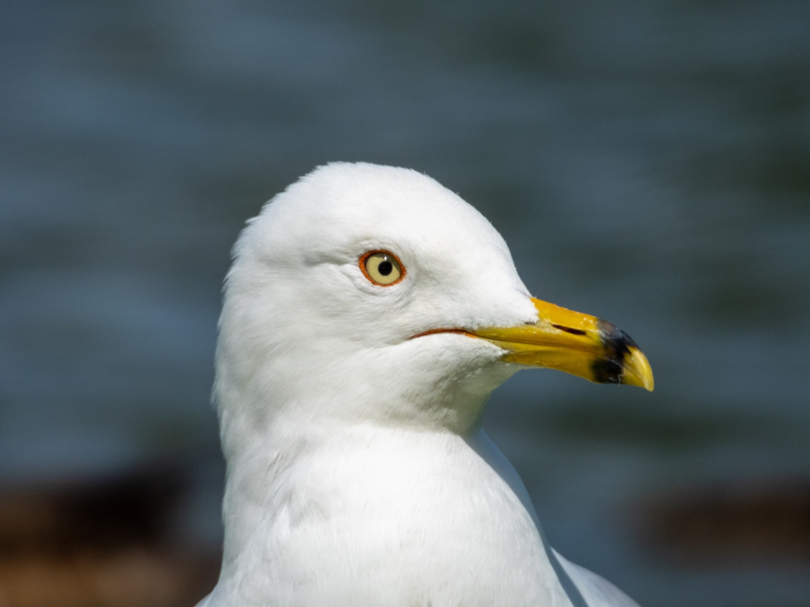

What is Project 366? Read more [here](https://thebirdsarecalling.com/2019/03/29/project-366/)!

Another hot day and another mid-day birding walk, this time in Hawrelak Park. The Ring-billed Gulls were out in full force. We had a picnic lunch in the shade of a tree and as soon as we were done our eating the gulls arrived for their eating. A pair of them were particularly bold as they walk right up to us and scanned our surrounding looking for a morsel to eat. They did manage to find a piece of bread hiding in the lawn only an arms length away from us. Because they were close and the bright mid-day sun they were easy to photograph. I rarely push my P1000 past the 1000 mm mark as the image quality rapidly deteriorates at longer focal lengths. Today, however, with the bright light, the gulls standing still watching our every move I could not resist pushing the focal length up to 1411 mm for a close up mug shot of one of the fellas. It pretty obvious why they are called Ring-billed Gulls. Whatever your opinion is about these opportunistic omnivores they are quite handsome and clever for someone with a bird brain. Any bird that’s can take advantage of humans to improve their own fortunes deserves our respect.

Ring-billed Gull (_Laura delawarensis_) at Hawrelak Park, Edmonton. July 14, 2019. Nikon P1000, 1411mm @ 35mm, 1/250s, f/5.6, ISO 100

_May the curiosity be with you. This is from “The Birds are Calling” blog ([www.thebirdsarecalling.com](http://www.thebirdsarecalling.com)). Copyright Mario Pineda._
