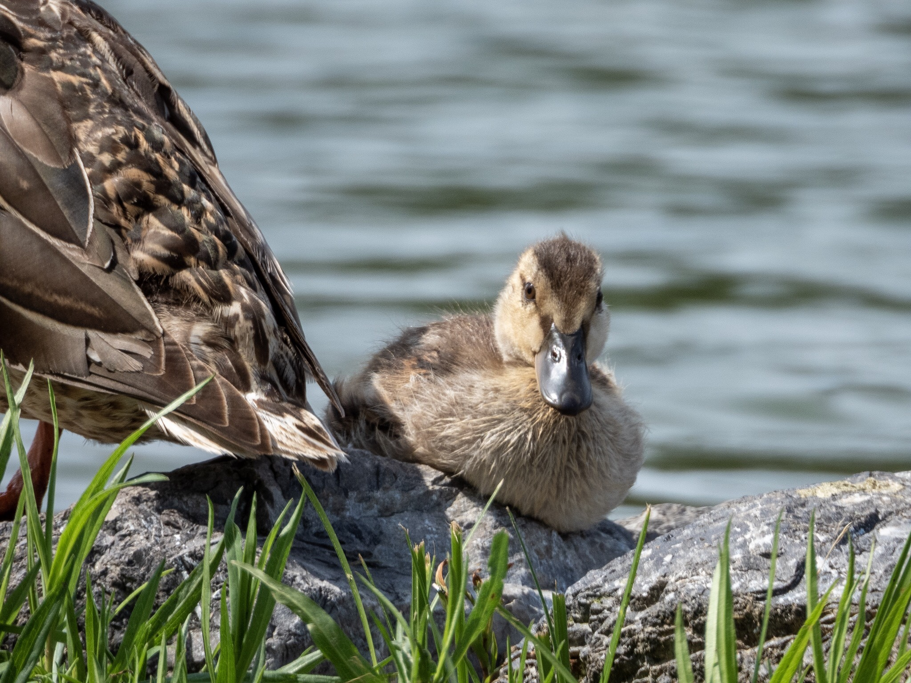

What is Project 366? Read more [here](https://thebirdsarecalling.com/2019/03/29/project-366/)!

The benefits of visiting city parks is that the wildlife is accustomed to human presence and is far less likely to be wary of humans. Case in point, as we were circumambulating the pond in Hawrelak Park we came across this female mallard with a single duckling sitting at the waters edge mere meters away from picnicking people. As we approached, they (the mallards, that is) were completely unphased by our presence and just ignored us. I ended up taking a few mugshots of the duckling from about 2 meters away and neither duckling or mom seemed to mind at all. Normally I would keep my distance to an animal with young offspring, but these two seemed completely at ease with all the people around them. They could have easily jumped into the water and swam away. Perhaps they took their chances around human as sometimes, I imagine, it might pay off in the forms of edible treats. Female mallards, which care and raise the young on their own, can lay up do a dozen eggs. It appeared that this female was left with a single offspring still “living at home”.

Mallard (_Anas platyrhynchos_) duckling at Hawrelak Park, Edmonton. July 14, 2019. Nikon P1000, 1210mm @ 35mm, 1/500s, f/5.6, ISO 140

_May the curiosity be with you. This is from “The Birds are Calling” blog ([www.thebirdsarecalling.com](http://www.thebirdsarecalling.com)). Copyright Mario Pineda._
