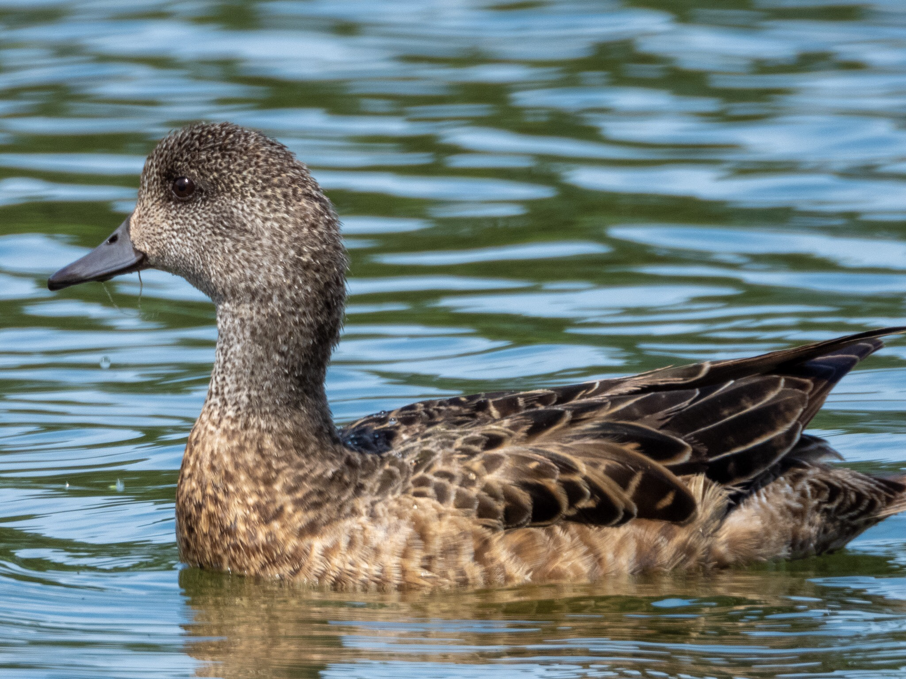

What is Project 366? Read more [here](https://thebirdsarecalling.com/2019/03/29/project-366/)!

Mixed in with the mallards in the Hawrelak pond were a few ducks that looked different. They were clearly females in their modest drabness, but they did not look like mallard females. These were American Wigeons. Last time we encountered these we were at Coal Lake during our Big Day on May 4 together with the Edmonton Nature Club. The Hawrelak pond (it does not seem to have an official name) is man made and was build in 1964. The pond is popular with water fowl in the summer and human ice skaters in the winter. Although there is not public swimming it has been used for the swimming portion of triathlon competitions. Next week this year’s World Triathlon Championships are taking place which means that the water fowl will share the pond with swimmers racing through the water. I suspect the birds might simply just move somewhere else during the event. In the past the City of Edmonton has chlorinated the pond to make it safe for the swimmers as it had problems with blue-green algae. I assume that chlorinated water is as safe for water fowl as it is to humans, but it will be interesting to see if the water fowl return to the pond after the sporting event. Looks like I might head down to the park during the event, not to look at the athletic performances, but rather to check in on the wigeons and the other birds.

Female American Wigeon (_Mareca americana_) at Hawrelak Park, Edmonton. July 14, 2019. Nikon P1000, 1008mm @ 35mm, 1/500s, f/5.6, ISO 160

_May the curiosity be with you. This is from “The Birds are Calling” blog ([www.thebirdsarecalling.com](http://www.thebirdsarecalling.com)). Copyright Mario Pineda._
