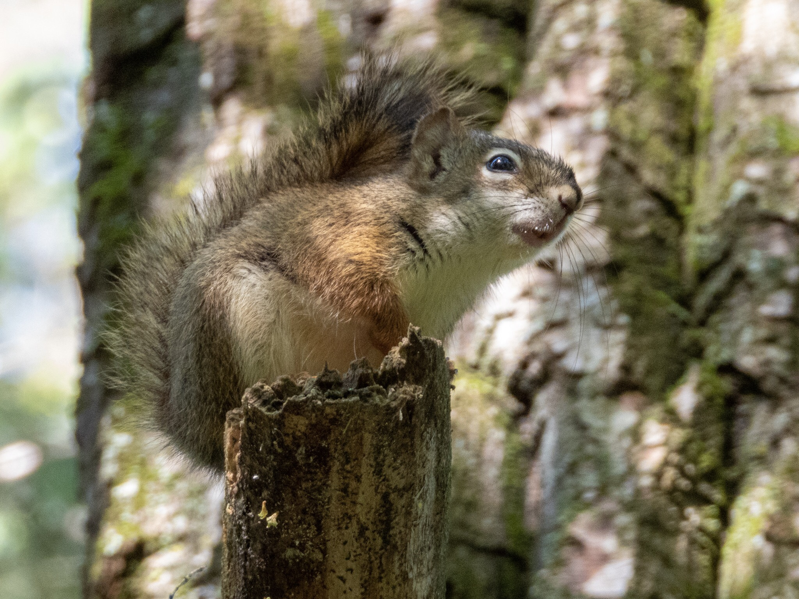

What is Project 366? Read more [here](https://thebirdsarecalling.com/2019/03/29/project-366/)!

One of the most common sounds in the forest along the Whitemud Ravine is the distinct chattering noise made by the Red Squirrel (_Tamiasciurus hudsonicus)._ Red Squirrels are solitary and territorial rodents that use their vocalization to announce their presence and defend their territory. In the fall they collect spruce and pine cones and hoard them underground in a central storage depot called a mídden. The midden is the main source of food during the winter and allows the squirrel to remain active throughout the winter. Because of the importance of these food caches they readily defend their territory from other squirrels that dare venture into it. Their address in the forest is permanent as individual squirrels stay in their territory for their entire lives. We came across this Red Squirrel that was perched on a branch along the trail making a cacophony of chattering sounds. As we walked past it it just ignored us and continued its noise making. Clearly this was the head of this territory and no squirrel or human should not even dare to think otherwise.

Red Squirrel (_Tamiasciurus hudsonicus_) at Whitemud Ravine, Edmonton. July 13, 2019. Nikon P1000, 605mm @ 35mm, 1/80s, f/5, ISO 400

_May the curiosity be with you. This is from “The Birds are Calling” blog ([www.thebirdsarecalling.com](http://www.thebirdsarecalling.com)). Copyright Mario Pineda._
