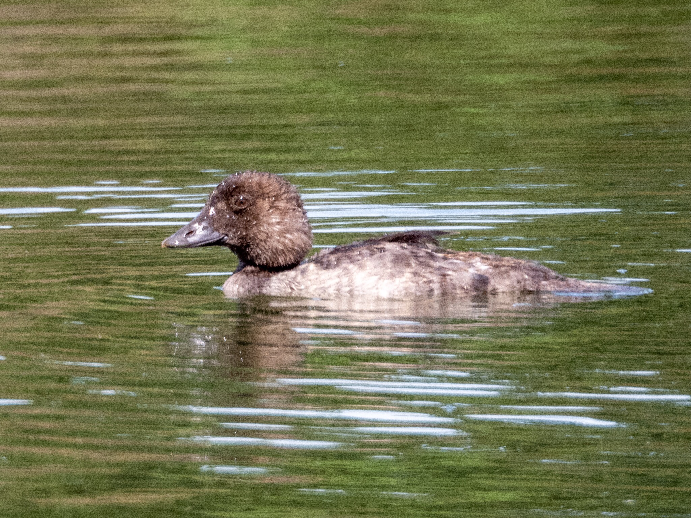

What is Project 366? Read more [here](https://thebirdsarecalling.com/2019/03/29/project-366/)!

Common Goldeneyes have a distance appearance as adults. Females having a chocolate brown head, yellow eyes and males have a distinct white cheek patch. When I spotted this fella chugging through the pond in Hawrelak park my initial hunch was that its overall shape reminded me of a Common Goldeneye, yet none of the other physical characteristics were there (no yellow eye, no check patch). Upon closer research this is likely an immature Common Goldeneye. Common Goldeneyes are diving ducks and this fella certainly lived up to that reputation as it was energetically diving, popping up for a few seconds and then disappearing under water again. If you look closely you can see his head covered in water droplets and sporting a fuzzy wet do.

Immature Common Goldeneye (_Bucephala clangula_) at Hawrelak Park, Edmonton. July 14, 2019. Nikon P1000, 1008mm @ 35mm, 1/500s, f/5.6, ISO 180

_May the curiosity be with you. This is from “The Birds are Calling” blog ([www.thebirdsarecalling.com](http://www.thebirdsarecalling.com)). Copyright Mario Pineda._
