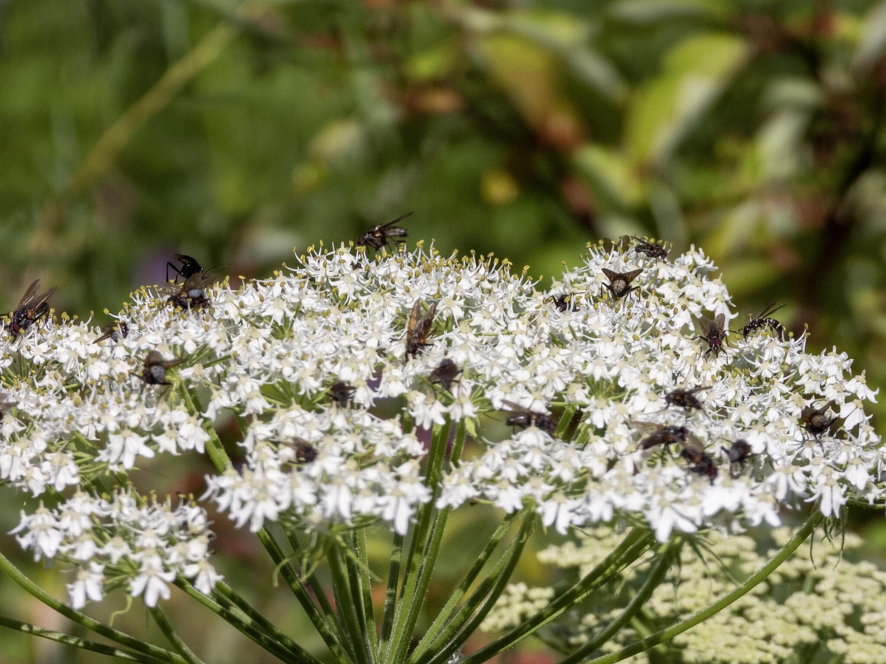

What is Project 366? Read more [here](https://thebirdsarecalling.com/2019/03/29/project-366/)!

After the [false alarm with the Giant Hogweed](http://thebirdsarecalling.com/2019/07/11/project-366-post-no-105-a-sheep-in-wolfs-clothing/) lookalike Cow Parsnip I have been seeing lots of these sheep in wolve’s clothing all over the place. The other day, as I spotted another specimen down at the Whitemud Ravine, I noticed that the inflorescence was busy with what looked like flies. I suspect the Cow Parsnip has something edible to offer to insects. While most of the insects looked like “regular” houseflies flies this is likely a complete misrepresentation of what they actually were. There seems to be a different looking fella on the far right of the flower that looks like a winged ant, perhaps it could be some sort of wasp, but I am going out on another limb here. Identifying insects is not trivial and I am an Uber noob at it to start with. It does appear the Cow Parsnips inflorescence attracts quite an attention from a wide range of insects such as mosquitoes, flies, hymenopterans, butterflies, thysanopterans and beetles.

Invertebrate feeding frenzy on a Cow Parsnip (_Heracleum maximum_) at the Whitemud Creek, Edmonton. July 13, 2019. Nikon P1000, 325mm @ 35mm, 1/1600s, f/5, ISO 100

_May the curiosity be with you. This is from “The Birds are Calling” blog ([www.thebirdsarecalling.com](http://www.thebirdsarecalling.com)). Copyright Mario Pineda._
