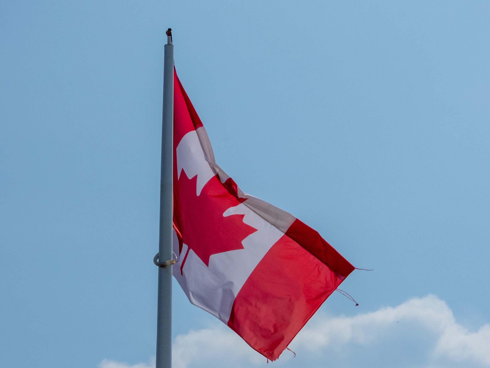

What is Project 366? Read more [here](https://thebirdsarecalling.com/2019/03/29/project-366/)!

As we were visiting the [Kiwi plant nursery](https://kiwinurseries.com/) at the outskirts of Spruce Grove I notice a soft chattering sound among the trees and shrubbery. I was pretty sure it was a bird but I was not familiar with who the suspect would be. I did not have to wait long. In short order the Barn Swallows came swooping in at low elevation, crisscrossing the sky in death defying maneuvers. One of the swallows landed on top of a tall flag post with a large Canadian flag fluttering in the breeze. I just had to take a picture of this diminutive bird perched on top of the post with a gigantic flag. How do you compose a picture like this? One could zoom in to get a closer look at the swallow, but then the flag would not be in the picture. Alternatively you zoom out to fit both the swallow and the flag, but then the bird is just a speck. I choose the second option. You can sort of see the rust coloured breast of the Barn Swallow (if you squint) sitting on top of the pole without a care in the world.

_Barn Swallow (Hirundo rustica) at Kiwi Nursery, Spruce Grove. July 20, 2019. Nikon P1000,_ 118_mm @ 35mm, 1/1600s, f/5.6, ISO 100_

_May the curiosity be with you. This is from “The Birds are Calling” blog ([www.thebirdsarecalling.com](http://www.thebirdsarecalling.com)). Copyright Mario Pineda._
