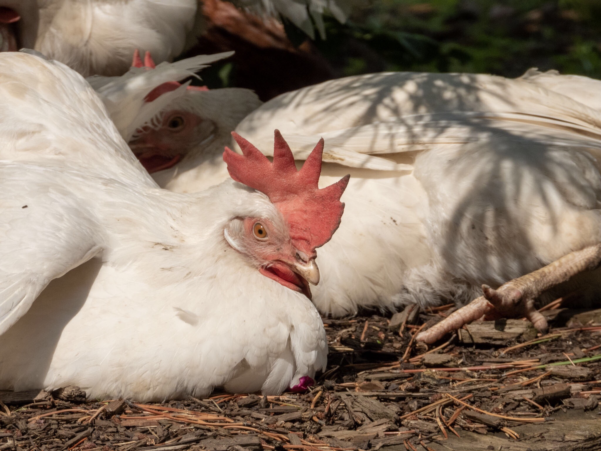

What is Project 366? Read more [here](https://thebirdsarecalling.com/2019/03/29/project-366/)!

The world loves its chickens. With an estimated total world population of more than 19 billion most of which end up in soups, stews and barbecues there are likely more chickens around than any other wild or domesticated bird. For me chickens are a no fly zone, I don’t eat them (as in, I don’t eat meat) and I don’t count them (as in, I don’t count them as a birder). Yesterday, as we were visiting the Kiwi plant nursery outside of Spruce Grove, I encountered my first chickens not wrapped in ceranwrap. They were running around among the plants looking like they had a jolly good time without a worry in the world. There is a long list of criteria that need to be fulfilled for one to be able to count a bird (as a birder), e.g. one cannot count birds in movies or photographs (but some people are known to practice [video game birding](https://kottke.org/19/01/going-birdwatching-in-red-dead-redemption-2)), one cannot count captive or caged birds and birds that have been introduced or released and have not established a viable population (there goes the errant budgie). Chickens, being captive, even when they are mischievously free running, are a no go. They were cute and funny though and I could not resist taking pictures of a few of the ladies basking in the afternoon sun. As I was observing them I found myself wondering where they came from (well, obviously from an egg, but before that...). Who is their wild chicken ancestor and are they still around? It turns out that the domesticated chicken (_Gallus gallus domesticus_) is a subspecies of the Red Junglefowl (_Gallus gallus_), a bird of the south East Asian tropics in the family Phasianidae. The junglefowl was first domesticated about 5000 years ago and the rest is history. Ebird refers to the Red Junglefowl as the “original chicken” and describes it as smaller than its domesticated descendants. The Red Junglefowl can be spotted running wild in South and Southeast Asia as well as in New Zealand and various Pacific and Caribbean islands where it was introduced. Well, now that I have met the domesticated chicken it seems only fitting that I one day track down and it wild cousins in a far more exotic location.

_Domesticated Chicken (Gallus gallus domestricus) at Kiwi Nursery, Spruce Grove. July 20, 2019. Nikon P1000, 571mm @ 35mm, 1/1600s, f/5, ISO 100_

_May the curiosity be with you. This is from “The Birds are Calling” blog ([www.thebirdsarecalling.com](http://www.thebirdsarecalling.com)). Copyright Mario Pineda._
