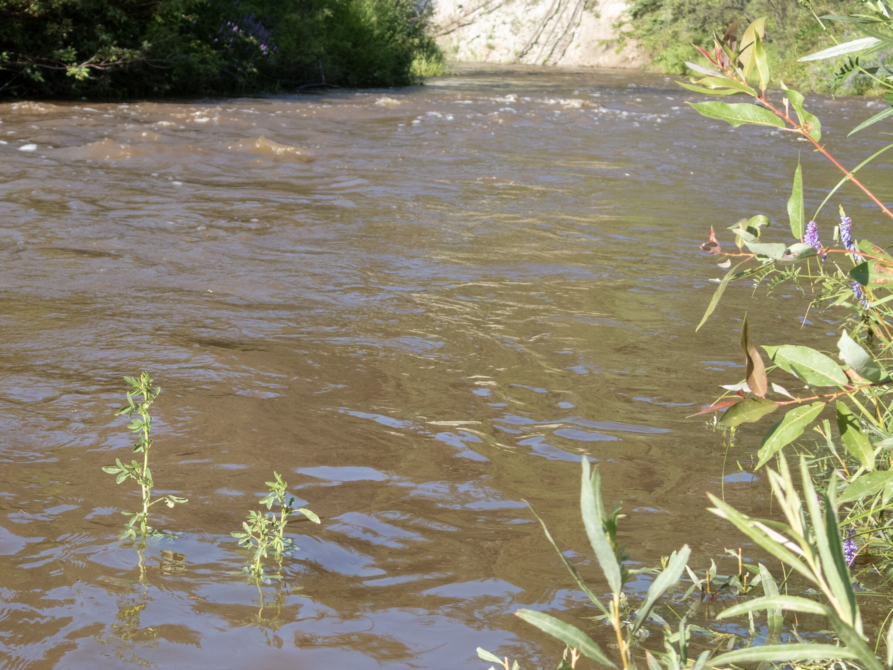

What is Project 366? Read more [here](https://thebirdsarecalling.com/2019/03/29/project-366/)!

This weekend we had the first two days this summer without rain. It has been a wet summer with daily thunderstorms and serious downpours. As a result the water level in Whitemud Creek is unusually high with part of the creek having fast flowing and frothing whitewater. Parts of the swollen banks have overflowed and inundated vegetation that normally would be on dry land. There seems to be a break in the rain, but now the “arctic heat” has moved in. With temperatures soaring to 30 °C this heat wave is unusual in that it did not come in from the south, but rather from the Northwest Territories, which have been under a heat warning the last few days. The last few days I have been out looking for birds during the hottest part of the days, either mid day or late afternoon. Needless to say, the timing has been completely off and I have not seen much as far as birds go. I think we are looking at some early morning nature walks this weekend to try to remedy the poor timing and get back into the groove of things.

High water with submerged vegetation at at the Whitemud Creek. July 22, 2019. Nikon P1000, 571mm @ 35mm, 1/1600s, f/5, ISO 100

_May the curiosity be with you. This is from “The Birds are Calling” blog ([www.thebirdsarecalling.com](http://www.thebirdsarecalling.com)). Copyright Mario Pineda._
