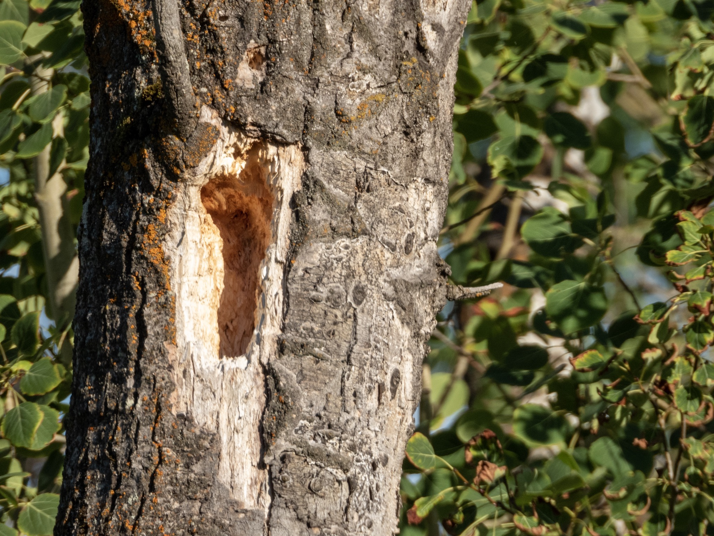

What is Project 366? Read more [here](https://thebirdsarecalling.com/2019/03/29/project-366/)!

I have seen my fair share of Pileated Woodpeckers in my lifetime, including some spectacularly destructive individuals that went to town on trees with such vigour that the wood chip went flying. It is always a treat to come across one these birds. They not only spectacular and impressive birds, but also quite noisy. The distinct sound when they work on a tree and their vocalizations, reminiscent of a hysterically laughing monkey, can be heard far and wide. The one thing I have not managed to do in the Pileated Woodpecker department, however, is to take a good (or at least half descent) picture of one. I have numerous out of focus and fuzzy photos that would perhaps qualify for the crap bird photography page, but they are definitely nothing to write home about. The best place to see Pileated Woodpeckers in my neck of the woods is down at the Whitemud Ravine. I regularly see them flying around and most dead standing trees have evidence of their busy work, but I have yet to snap a picture of one in action.

_May the curiosity be with you. This is from “The Birds are Calling” blog ([www.thebirdsarecalling.com](http://www.thebirdsarecalling.com)). Copyright Mario Pineda._
