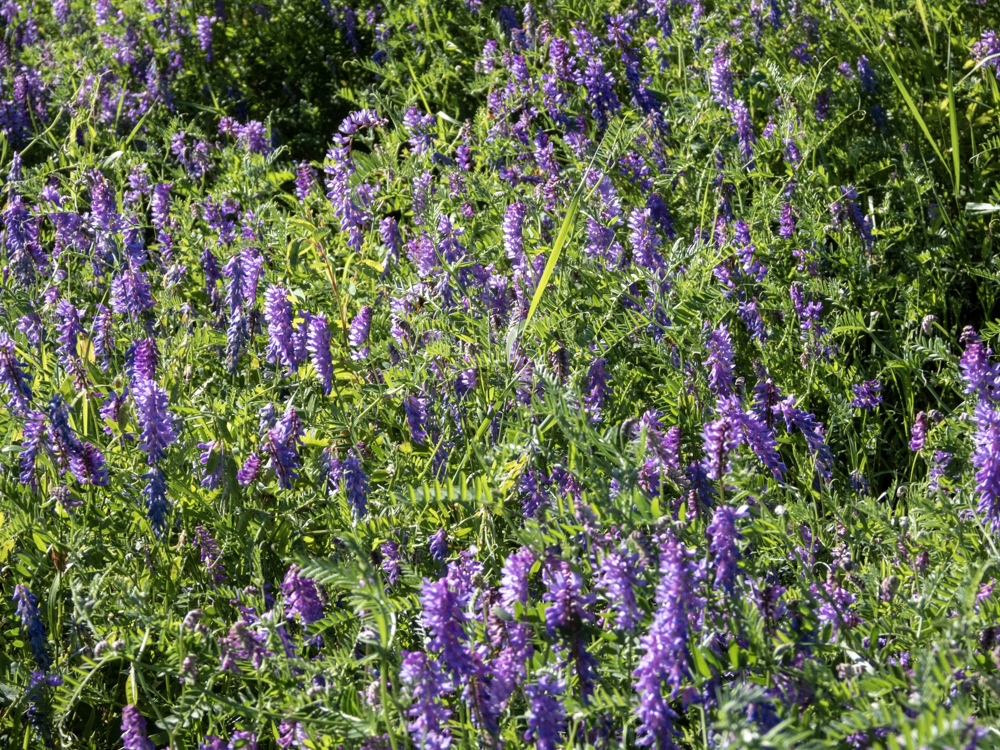

What is Project 366? Read more [here](https://thebirdsarecalling.com/2019/03/29/project-366/)!

There’s is a strip of meadow between the parking lot at the Whitemud Creek and the MacTaggard Sanctuary. This time of year it’s all pretty with flowers in bloom, bumblebees zipping between the flowers and thousands upon thousands of grasshoppers jumping around in the hot afternoon sun. Last week the meadow it was covered in a sea of purple flowers. Of course clueless as I am about botany I had no clue what they were. They were, however, not hard to identify once had access to Internet. It’s the Cow Vetch (_Vicia cracca_), also known as Tufted Vetch, Bird Vetch, Blue Vetch and Boreal Vetch, and although it is beautiful there are skeletons in its closet. It is native to Europe and Asia and an invasive species in North America where it is considered a weed. While the flowers are much appreciated by bees, bumblebees and butterflies, cattle like likes to munch on it and (allegedly) budgerigars have a particular fondness for the seeds it is a fast growing colonizing species and often dominates disturbed habitats before native plants have a chance to become established. Cow Vetch is in the family as peas and has climbing stems with noose-like branched tendrils that wrap themselves around other plants, often strangling smaller plants.

_May the curiosity be with you. This is from “The Birds are Calling” blog ([www.thebirdsarecalling.com](http://www.thebirdsarecalling.com)). Copyright Mario Pineda._
