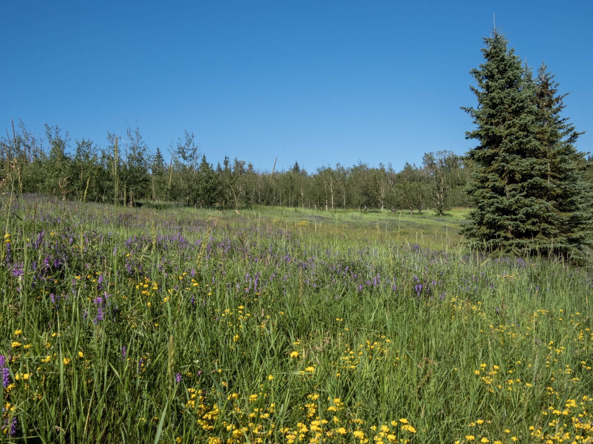

What is Project 366? Read more [here](https://thebirdsarecalling.com/2019/03/29/project-366/)!

South of the 23 Avenue, as it crosses the Whitemud Ravine, the Whitemud Creek splits into two, the Whitemud and the Blackmud Creeks. Right along the confluence of the two creeks there is a large meadow covered in tall grass and purple Cow Vetch. Last time I was there it was a hot sunny afternoon and the meadow was buzzing with grasshoppers. With every step, hundreds of grasshoppers were flushed out of the tall grass around my legs, jumping in all directions simultaneously. As I was making my way through the tall grass the possibility of ticks making a meal out of me did cross my mind. I have yet to find a tick in Alberta and I certainly hope it stays that way. The last time I had an intimate encounter with this bloodsucking parasite was about 30 years ago in central Sweden, when, after a day of portaging a canoe, to my horror I discovered a tick in the warm moist nether regions. By the dim light of a flashlight we ended up having to carve out the beast at night in our tent. Ever since that incident I have a healthy aversion to these critters. To play it safer, I decided to stay on the trails that meander through the meadow, rather than walking in the tall grass. I could hear lots of song birds, but this late in the afternoon most of the were skulking among the leaves and were difficult to spot.

_May the curiosity be with you. This is from “The Birds are Calling” blog ([www.thebirdsarecalling.com](http://www.thebirdsarecalling.com)). Copyright Mario Pineda._
