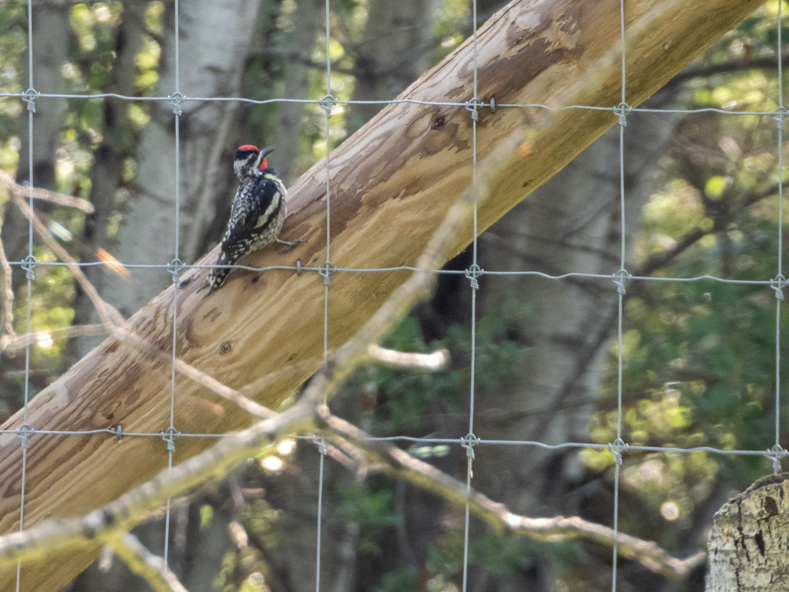

What is Project 366? Read more [here](https://thebirdsarecalling.com/2019/03/29/project-366/)!

Right by the parking lot at the south side of Elk Island National Park there was an energetic Yellow-bellied Sapsucker hard at work trying to drill holes in the posts of a widening fence. Sapsuckers are known for creating symmetrical rows with large number of shallow holes on trees in order to harvest tree sap. I wonder if it was working on the wooden fence by mistake (which clearly will not have many sap) or if it was looking for insects (which the fence posts may have). Sapsuckers can make a large number of holes in a single tree and there are known instances where trees are girdled by overly enterprising sapsuckers. The Yellow-bellied Sapsuckers is our only woodpeckers that migrate south in the winter.

_Yellow-bellied Sapsucker (Sphyrapicus varios) at Elk Island National Park. June 30, 2019. Nikon P1000, 756mm @ 35mm, 1/125s, f/5.6, ISO 400_

_May the curiosity be with you. This is from “The Birds are Calling” blog ([www.thebirdsarecalling.com](http://www.thebirdsarecalling.com)). Copyright Mario Pineda._
