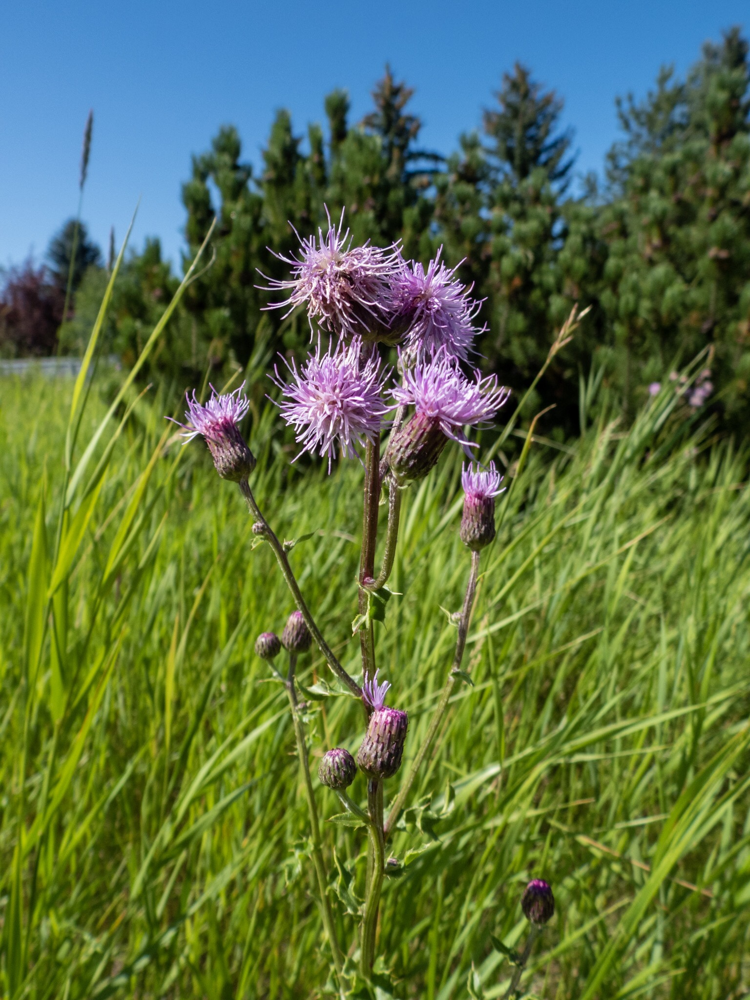

What is Project 366? Read more [here](https://thebirdsarecalling.com/2019/03/29/project-366/)!

Another pretty flower with an insidious secret. We came across the Creeping Thistle the other day just off the Whitemud Creek as we were on a nature bike ride. Just like other recent pretty flowers we have come across (for example, [Cow Vetch](http://thebirdsarecalling.com/2019/07/24/project-366-post-no-118-a-sea-of-tufted-vetch/), [Red Clover](http://thebirdsarecalling.com/2019/07/12/project-366-post-no-106-red-clover/) and [Meadow Buttercup](http://thebirdsarecalling.com/2019/06/25/project-366-post-no-088-meadow-buttercup/)) the Creeping Thistle is an invasive weed that was introduced from Europe and Asia. To add insult to the injury it is often referred to as Canada Thistle, which is of course misleading since it is not of Canadian origin. As far as I can tell, it was introduced in North America accidentally, most likely as a contaminant in crop seeds. There used to be a [Thistle Patrol](https://www.google.com/amp/s/natureedmonton.wordpress.com/2013/08/08/thistle-patrol/amp/) here in Edmonton that went around to natural areas pulling out creeping thistles. Although there are effective herbicides that kill the plant they also kill the native plant, so the incentive behind the Thistle Patrol was to remove this invasive weed manually to avoid the need for spraying herbicides. I have not been able to find any information about the Thistle Patrols activities these days (most recently they seemed to be active in 2013), perhaps the patrol has retired. Did they “win” the battle against the Creeping Thistle or was it too big of a job to keep up with? Who knows?

_Creeping Thistle (Cirsium arvense) at Whitemud Creek. July 26, 2019. Nikon P1000, 26mm @ 35mm, 1/1600s, f/2.8, ISO 100_

_May the curiosity be with you. This is from “The Birds are Calling” blog ([www.thebirdsarecalling.com](http://www.thebirdsarecalling.com)). Copyright Mario Pineda._
