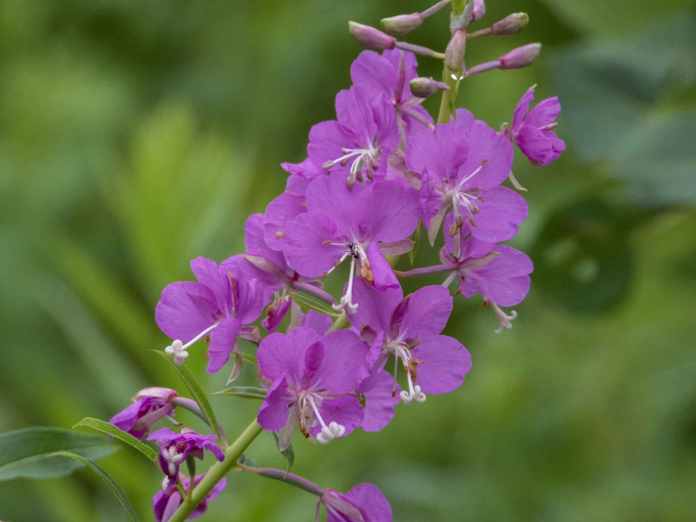

What is Project 366? Read more [here](https://thebirdsarecalling.com/2019/03/29/project-366/)!

Another milestone! Post 122 out of 366 makes it one third of the way through my Project 366. Four months in and I think I can safely say that have the ropes figure out by now and that I am on the proverbial roll.

I went for a nature walk this morning to the Whitemud Creek. To mix things up a bit I accessed the trail system from a [secluded and well-hidden trail head in the Ogilvie Ridge neighbourhood](http://Dropped pin Near Unnamed Road, Edmonton, AB T6R 2C3 https://goo.gl/maps/wTWuw5nXYaagKHuYA). This trail head takes you right into a portion of the Whitemud Ravine south of Snow Valley. According to the map it is about a 4 km walk to Snow Valley but I did not go that far today. It started out cloudy and breezy but the sun snuck out behind the clouds about one hour into the walk. The highlight of the walk was the “discovery” of a a pair of ponds off the trail that were busy with all manners of bird life such as Bohemian Waxwings, Eastern Pheoebes, House Finches, and a Downy Woodpecker (no waterfowl though). There was also evidence of recent beaver activity. These ponds do not appear on any map or even in Google Earth. I am sure the ponds are know to the locals, but they are not visible from the main trail and one has to meander through a brushy meadow to find them. As I was finding my way across the meadow I encountered stands of Fireweed (_Epilobium angustifolium_) a tall perennial herbaceous plant related to willows. The Fireweed is native throughout the temperate Northern Hemisphere, including throughout the boreal forests of Canada. It is a pioneer species and is often one of the first colonizer after forest fires, hence the name Fireweed. It was known as bombweed during the Second World War as it was rapid to colonize bomb craters. Fireweed is one of the best known medicinal plants and has been used worldwide in traditional medicine. Experimental and clinical studies have confirmed that all parts of the plant have a [broad range of pharmacological and therapeutic properties](https://www.ncbi.nlm.nih.gov/pmc/articles/PMC5045895/), including antioxidant, anti-proliferative, anti-inflammatory, antibacterial, and anti-aging properties. A recent review of the therapeutic potential of Fireweed provides an impressive list of benefits:

> _Traditional use of fireweed includes an infusion or tea, which has been reported as a treatment for migraine headaches, insomnia, anemia, delirium tremens, infections, and colds. E. angustifolium extracts have been reported to be effective treatments for gastric ulcer; duodenal ulcer; gastritis; colitis; various gastrointestinal disorders, such as dysentery and diarrhea; and prostate or urinary problems, such as urethral inflammation, micturition disorders, prostatic adenoma, and benign prostatic hyperplasia (BPH). E. angustifolium has also been used topically as a cleansing, soothing, antiseptic, and healing agent to treat minor burns, skin rashes, ulcers, and infections, and for treatment of inflammation of the ear, nose, and throat..._
> 
> [Schepetkin et al. (2016)](https://www.ncbi.nlm.nih.gov/pmc/articles/PMC5045895/)

Although I am not suffering from any of the listed ailments at the present time, it am tempted to head back and collect some of the leaves while they are available to keep a stash of this miracle plant at home for future uses.

_Fireweed (Epilobium angustifolium) at Whitemud Creek. July 28, 2019. Nikon P1000, 605mm @ 35mm, 1/250s, f/5, ISO 160_

_May the curiosity be with you. This is from “The Birds are Calling” blog ([www.thebirdsarecalling.com](http://www.thebirdsarecalling.com)). Copyright Mario Pineda._
