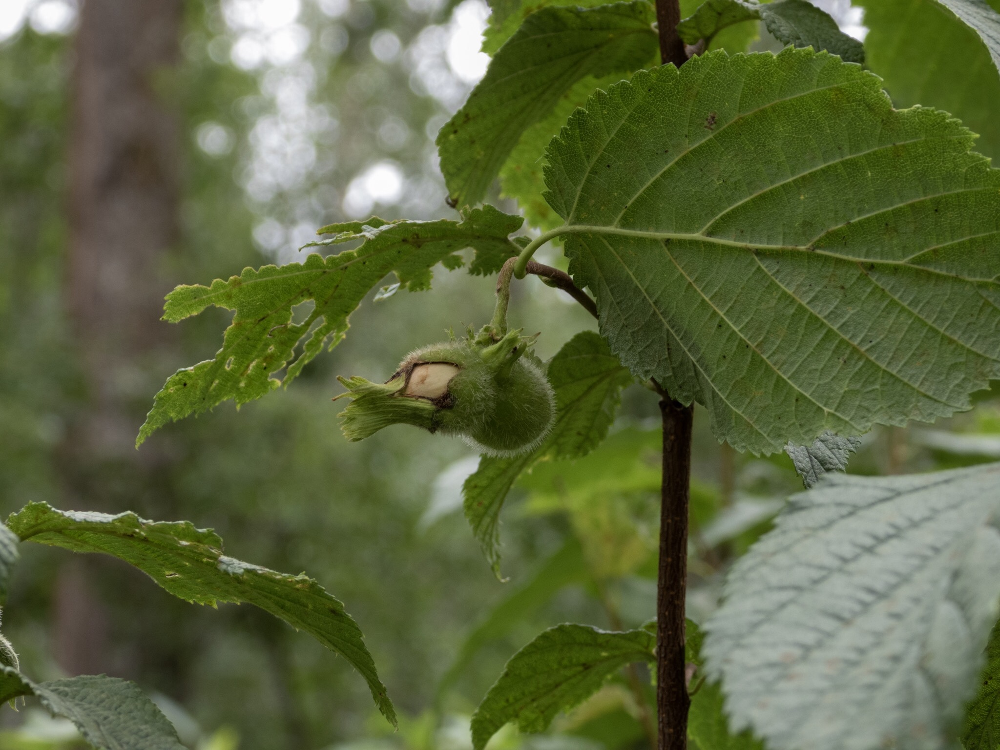

What is Project 366? Read more [here](https://thebirdsarecalling.com/2019/03/29/project-366/)!

I came across a stand of shrubs along the Whitemud Ravine trail that looked like Beaked Hazelnut (_Corylus cornuta_). It had the typical serrated leaves and the small catkins (the male flowers), but I did not find any female flowers or any nuts so I was a bit on the fence for a positive identification. That was until I found one shrub that had the characteristic bristly husks that look like long beaks (hence the name Beaked Hazelnut). The nuts grow inside these husks. The Beaked Hazelnut is our only nut-bearing native shrub and is an important source of food for, you guessed it, squirrels and chipmunks. Birds, such as woodpeckers and jays, also enjoy a nut as a snack. While the nuts are edible, store-bought hazel nuts typically come from the Common Hazel (_Corylus avellana_) which grows in Europe, around the Mediterranean Sea and throughout Western Asia. For a minute I was tempted to try the nut but decided to stick to the adage of only taking pictures and only leaving footprints and decided to leave the nut for the denizens of the forest.

_Beaked Hazelnut (Corylus cornuta) at Whitemud Creek. July 28, 2019. Nikon P1000, 106mm @ 35mm, 1/60s, f/4, ISO 100_

_May the curiosity be with you. This is from “The Birds are Calling” blog ([www.thebirdsarecalling.com](http://www.thebirdsarecalling.com)). Copyright Mario Pineda._
