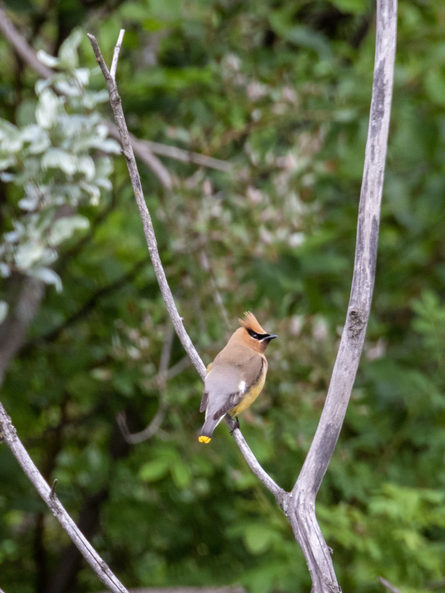

What is Project 366? Read more [here](https://thebirdsarecalling.com/2019/03/29/project-366/)!

Another Cedar Waxwing post (there was a previous one recently [here](http://thebirdsarecalling.com/2019/07/07/project-366-post-no-101-cedar-waxwings-at-the-mactaggard-sanctuary/)). It is hard to resist these photogenic birds with their punky hairdo. They are easily found down in the Whitemud Ravine during the summer as they seem to like to hang out by streams and ponds. They are sociable and tend to be seen in flocks. This individual was down at a small pond together with 3 of its mates. Cedar Waxwings have a bit of a reputation for enjoying munching on berries (such as Mountain Ash berries) that are overripe and have begun to ferment. As it turns out, fermented fruit has the same effect on birds as it has on humans. I guess by this measure they would be considered the party animals down of the creek. So there you have it folks - humans get their fermented fruit on Whyte Ave and Cedar Waxwings get it down by the creek. On this sunny summer day, however, these particular waxwings were on their best behaviour.

_Cedar Waxwing (Bombycilla cedrorum) at Whitemud Creek. July 28, 2019. Nikon P1000, 1109mm @ 35mm, 1/500s, f/5.6, ISO 400_

_May the curiosity be with you. This is from “The Birds are Calling” blog ([www.thebirdsarecalling.com](http://www.thebirdsarecalling.com)). Copyright Mario Pineda._
