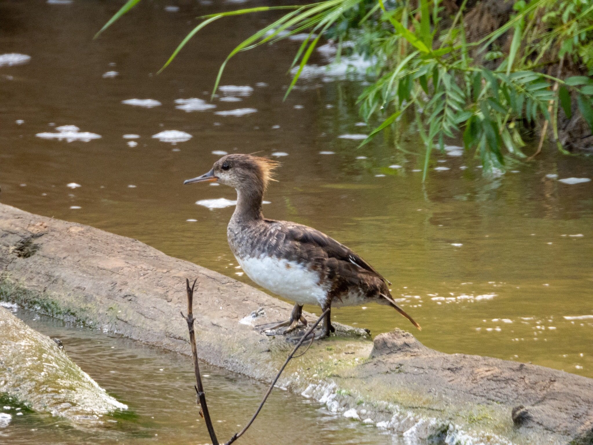

What is Project 366? Read more [here](https://thebirdsarecalling.com/2019/03/29/project-366/)!

So here is a bit of a stumper. I came across this waterfowl sitting on a log in the creek the other day. It was alone and the question that immediately came to my mind was “What is it?”. My hunch is that it was an immature Common Merganser, given the spiky hairdo, white belly, overall grey with a hint of reddish-brown on the head. What makes me second guess myself, however, is the bill and the legs. Both these appendages are red to brownish-red in Common Merganser. On this individual, however, the colours were nowhere close to that. On the other hand though, the bill and leg colours are brightest on adult males and are progressively duller the younger the individual is. Comparing this individual to other Common Mergansers I have seen and online images online + cross referencing with reported sightings at this location in eBird does not leave many other options available. It is interesting that while one typically relies on unique species specific field marks when identifying birds, birds can be as variable in appearance as humans and sometimes you come across individuals that only partially fit the search image. It is in situations like this that being able to take a picture of the birds is invaluable, particularly afterwards when you start questioning your observation. While today’s picture may not stand up to the scrutiny of pixel peepers it does serve its intended purpose, to document an individual and aid in its identification and, lets face it, being shot at the 35 mm equivalent of 1008 mm there are few other camera set ups that could pull this of. Yes you could probably shoot it at 600 mm on a full frame camera and then crop in post-processing and end up with an image with a higher resolution..., or you could get a Nikon P1000 and take the cash you save and go on a photo safari to <_name of your choice of a far away exotic location_\>. For me it is a easy choice, travel always trumps hardware. Let’s put it this way. When you are old and gnarly reminiscing about your birding heydays, what’s will you remember? Will you fondly remember you top of the line equipment and massive 600 mm optics? Or will you remember that epic birding trip you did with you family to <_name of your choice of a far away exotic location_\> where you scored _n_ lifers (where _n_ is a very large number) and created memories to last a lifetime? Nuff said!

_Immature waterfowl at Whitemud Creek. July 29, 2019. Nikon P1000, 1008mm @ 35mm, 1/125s, f/5.6, ISO 640_

_May the curiosity be with you. This is from “The Birds are Calling” blog ([www.thebirdsarecalling.com](http://www.thebirdsarecalling.com)). Copyright Mario Pineda._
