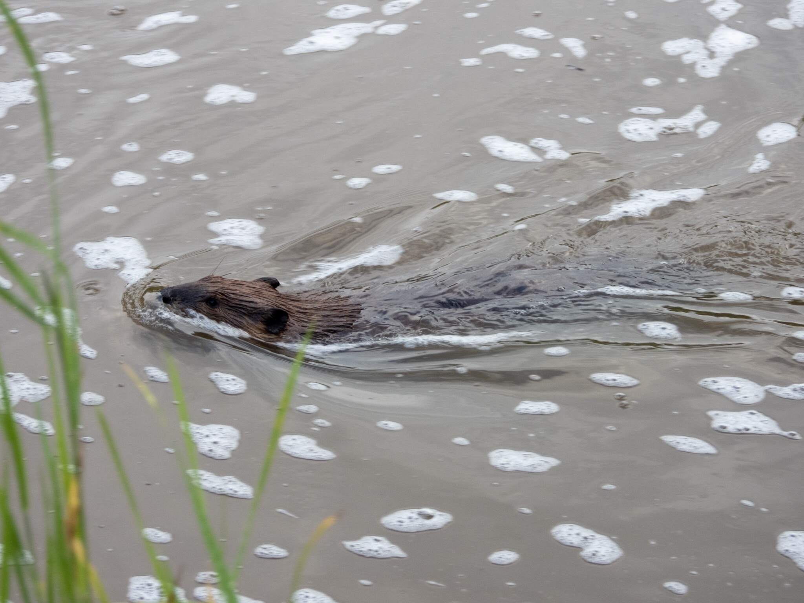

What is Project 366? Read more [here](https://thebirdsarecalling.com/2019/03/29/project-366/)!

Well, I don’t actually know if the beavers are back..., I do know, however, that at least one beaver is back at the Whitemud Creek. The last time I encountered beavers at the creek was over three months ago back in mid-April ([See Post No. 020](http://thebirdsarecalling.com/2019/04/17/project-366-post-no-020-tracks-in-the-sand/)). At that time there were beavers galore in the creek and then they just vanished. There is obviously much more to this story, but I’ll save that for a different day. What matters is that it appears that a beaver has somehow found its way back to the creek. A few days ago I caught a fleeting glimpse of one individual doing the rounds in the creek. I just barely managed to snap a picture of it. It is a good thing I did, otherwise I probably would have been second guessing myself, questioning myself if I really had seen what I thought I had seen or if my eye or brain were just playing tricks on me. I am intrigued about where this beaver came from. Did it swim in from the North Saskatchewan River or did it come down from an upstream location of the creek? My suspicion is that it came in from the North Saskatchewan River, but I have no idea how to prove that. I have to admit that while it was super exciting to spot a beaver at the creek again, it did not come entirely as a surprise. A few days earlier I saw the writing on the wall in the form of a freshly felled poplar bearing the unmistakable signs of a beavers handywork.

An American _Beaver (Castor canadensis) at Whitemud Creek. July 29, 2019. Nikon P1000, 134mm @ 35mm, 1/125s, f/4, ISO 100_

_May the curiosity be with you. This is from “The Birds are Calling” blog ([www.thebirdsarecalling.com](http://www.thebirdsarecalling.com)). Copyright Mario Pineda._
