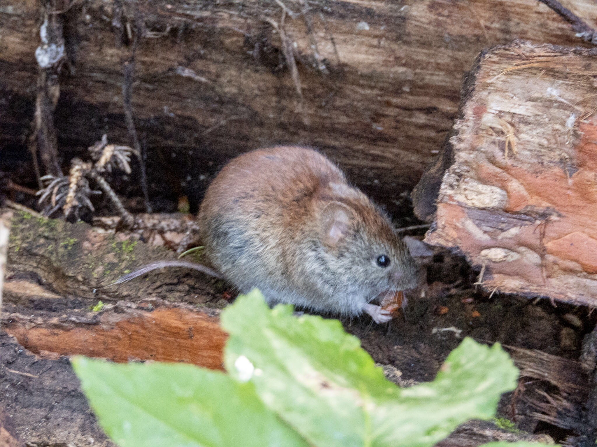

What is Project 366? Read more [here](https://thebirdsarecalling.com/2019/03/29/project-366/)!

Red-back Voles are common inhabitants of the northern forests. Just as the name suggests the fur on their back is reddish brown. There are two species of red-back voles in Canada, the Northern Red-back vole (_Myodes rutilis_) and the Southern Red-back vole (_Myodes gapperi_). [Studies have shown](https://www.zoology.ubc.ca/~krebs/papers/263.pdf) that the Northern Red-back Vole occurs north of latitude 60°N and the Southern Red-back Vole south of 60°N with virtually no overlap between the two species in North America. Edmonton is located at 53°N and the 60 parallel North constitutes the border between Alberta and the Northwest Territories. This means that most likely this is a Southern Red-backed Vole. This fella did not seem to be particularly shy. It just continued to munch on its snack while I was taking pictures only a few meters away.

Southern _Red-back Vole (Myodes gapperi) at Whitemud Creek. July 29, 2019. Nikon P1000, 538mm @ 35mm, 1/20s, f/5, ISO 1000_

_May the curiosity be with you. This is from “The Birds are Calling” blog ([www.thebirdsarecalling.com](http://www.thebirdsarecalling.com)). Copyright Mario Pineda._
