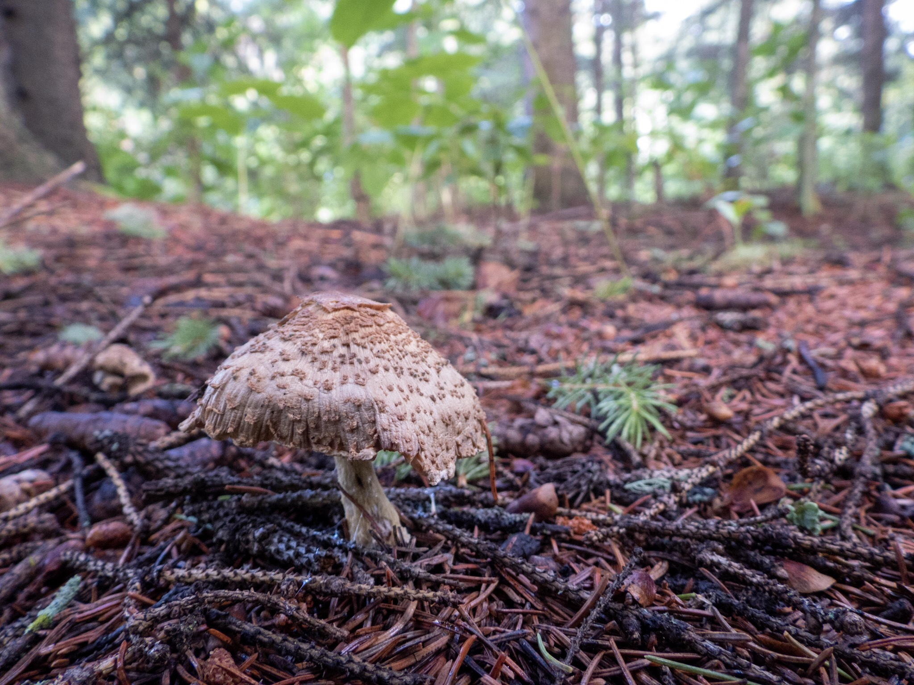

What is Project 366? Read more [here](https://thebirdsarecalling.com/2019/03/29/project-366/)!

A mushroom walks into a bar. The bartender said “We don’t serve your kind here”. The mushroom replied: “Why not? I am a fun guy.” Once you wipe the cringy grin off your face we can move on. We have received a lot of rain this summer (daily and nightly) and as a result of this three things have happened, (1) everything has been growing like crazy and many of the smaller trails down at the creek are overgrown and inaccessible, (2) the mosquitoes population has exploded and one is surrounded by a cloud of thirsty females every time one ventures into the forest and (3) the forest is full of fungi fruiting bodies aka mushrooms. Although I tried to identify this mushroom I came up empty handed. It’s a mushroom, nuff said.

Unidentified mushroom _at Whitemud Creek. July 29, 2019. Nikon P1000, 26mm @ 35mm, 1/30s, f/2.8, ISO 320_

_May the curiosity be with you. This is from “The Birds are Calling” blog ([www.thebirdsarecalling.com](http://www.thebirdsarecalling.com)). Copyright Mario Pineda._
