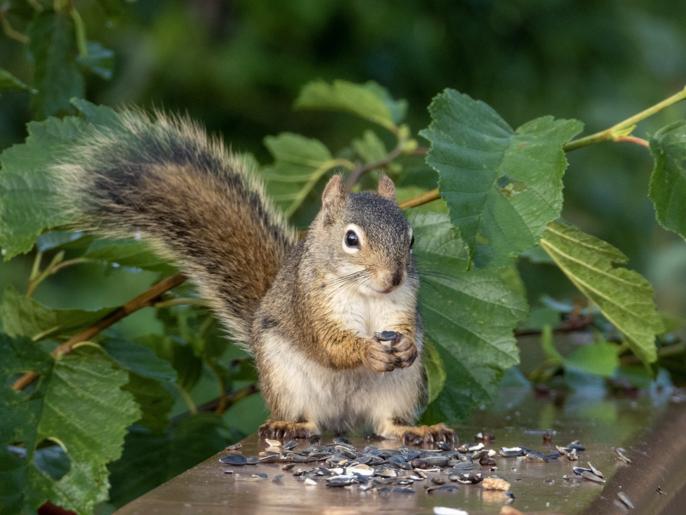

What is Project 366? Read more [here](https://thebirdsarecalling.com/2019/03/29/project-366/)!

One reason many of the inhabitants at the Whitemud Creek are so comfortable around humans might be the regular treats they receive from us. On any given day it is common to find sunflowers seeds strewn along the trail, placed on stumps, logs and bridge railings. I am a bit ambivalent about this practice. One one hand, it allows adults and children to easily view the squirrels, voles, chickadees, nuthatches and other inhabitants, which clearly serves an educational purpose. On the other hand, sometimes when wildlife associates humans with food bad things happens. I can see this being a valid concerns when feeding (on purpose on inadvertently) large animals such as coyotes, bears and elk, but squirrels and small birds? What harm can a chickadee possibly do? In all fairness, if you will be feeding wildlife, sunflowers seeds are probably the most nutritious foodstuff you could offer them. I am sure there are additional aspects one could discuss, e.g. how does feeding affect survival, breeding success, population dynamics and interactions between animals. Apparently you can be fined if you are found feeding the wildlife at Whitemud Creek. There are stories of the RCMP and park rangers handing out tickets to sunflower-carrying offenders. This fella, however, looked quite grateful for a sunflower seed snack and was not about to issue a ticket.

American Red Squirrel (_Tamiasciurus hudsonicus_) at Whitemud Creek. July 30, 2019. Nikon P1000, 571mm @ 35mm, 1/250s, f/5, ISO 160

_May the curiosity be with you. This is from “The Birds are Calling” blog ([www.thebirdsarecalling.com](http://www.thebirdsarecalling.com)). Copyright Mario Pineda._
