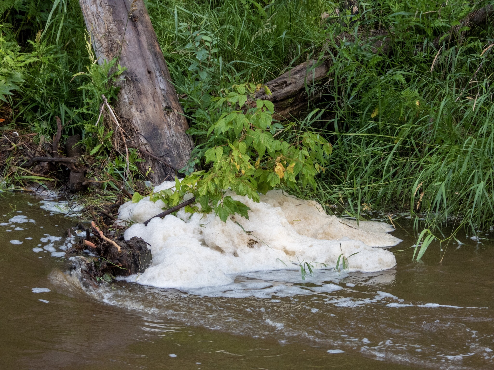

What is Project 366? Read more [here](https://thebirdsarecalling.com/2019/03/29/project-366/)!

All of a sudden last week foam started to appear in the Whitemud Creek. Large floating rafters of yellowish foam floating down the creek and getting stuck in the vegetation along the shorelines. Most people’s first reaction is probably that the foam is due to pollution. While pollution can certainly cause foam in fresh and salt water it turns that foam also can be created through natural processes. These so called foam lines are often found on streams and river surfaces when water is strongly mixed with air, for example at water falls where rocky substrate have fast currents passing over its. Foam lines are common in streams with brown water which contain high levels of dissolved organic carbon from decomposing algae and other plant matter. Much of the foam is formed after snowmelt and after prolonged heavy rains. The Whitemud Creek fulfills all these criteria, we have had large amounts of rain this summer, the water level is high, the current is strong in the creek and the water is murky brown. Things always change at the creek, from it being frozen in the winter, ice floes and water-ice slurry in the spring, high water levels during the spring melt and during the rainy summer to low and clear waters during the end of the spring and before the rainy season.

Foam lines in Whitemud Creek. July 30, 2019. Nikon P1000, 202mm @ 35mm, 1/200s, f/4.5, ISO 100

_May the curiosity be with you. This is from “The Birds are Calling” blog ([www.thebirdsarecalling.com](http://www.thebirdsarecalling.com)). Copyright Mario Pineda._
