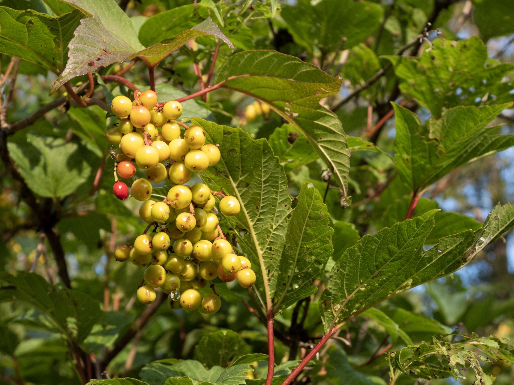

What is Project 366? Read more [here](https://thebirdsarecalling.com/2019/03/29/project-366/)!

Along the trail at the Whitemud Creek one can find Low-bush (_Viburnum opulus_) and High-bush Cranberries (_Viburnum edule_). Calling these shrubs cranberries is misleading as they are more closely related to elderberries than to the true cranberry. They produce a stone fruit called a drupe (a drupe is fleshy fruit with a central stone like core containing one or more seeds), like a cherry, whose acidic flavour resembles that of the cranberries. The fruit have a tangy musky odour and not a favourite food of birds. During the winter, when other sources of food are scarce, the berries often become survival food for birds such as waxwings and robins. Both the Low-bush and High-bush Cranberry shrubs are native to North America and can be found in thickets along shorelines and creeks, swamps and forest edges. Both species appear identical, except one of the grows low (up to 2 m) and the other species grows high (up tp 4 m). It is left to the reader to deduce which one is which.

High-bush Cranberry (_Viburnum opulus_) at the Whitemud Creek. July 30, 2019. Nikon P1000, 78mm @ 35mm, 1/320s, f/3.5, ISO 100

_May the curiosity be with you. This is from “The Birds are Calling” blog ([www.thebirdsarecalling.com](http://www.thebirdsarecalling.com)). Copyright Mario Pineda._
