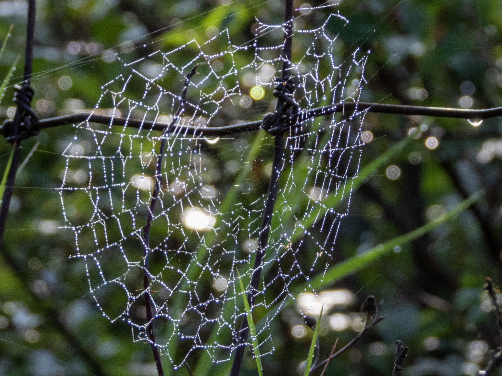

What is Project 366? Read more [here](https://thebirdsarecalling.com/2019/03/29/project-366/)!

Different species of spiders create different types of spider webs. The spider web type that probably come to your mind first is the classical spiral orb web design. This type of web is created by spiders in the Araneidae family, aka as orb-weaving spiders. With 3122 species these are the most commonly found spiders across the world. Many orb-weaving spiders build a new web each day. They tend to hide during the day and become active during the evening hours when they consume the old web before spinning a new web in the same general location. As a result the webs of orb-weaving spiders are generally clean and free of accumulated debris. This spider web that I came across on an early morning down by the Whitemud Creek was covered in morning dew. Tiny water droplets were strung up on the silk fibres like bright pearls strung on a sting. The ability of spider webs to collect water is unique and difficult to understand. For example, human hair cannot do this. As it turns out [a recent study](https://www.nature.com/news/2010/100203/full/news.2010.47.html) showed that the water collection ability of spider silk is an artefact of the microscopic structure of the silk. As far as we know the ability for spiders silk to collect water does not seem to serve any biological purpose. On the contrary, when the spider silk is wetted it reduces its ability to capture prey, an obviously bad thing from the spider’s perspective. One cannot deny, however, that morning dew captured on a spider web is a very photogenic effect that we humans probably enjoy more than the spider itself.

Dew in spiral orb web at the Whitemud Creek. July 30, 2019. Nikon P1000, 258mm @ 35mm, 1/250s, f/4.5, ISO 100

_May the curiosity be with you. This is from “The Birds are Calling” blog ([www.thebirdsarecalling.com](http://www.thebirdsarecalling.com)). Copyright Mario Pineda._
