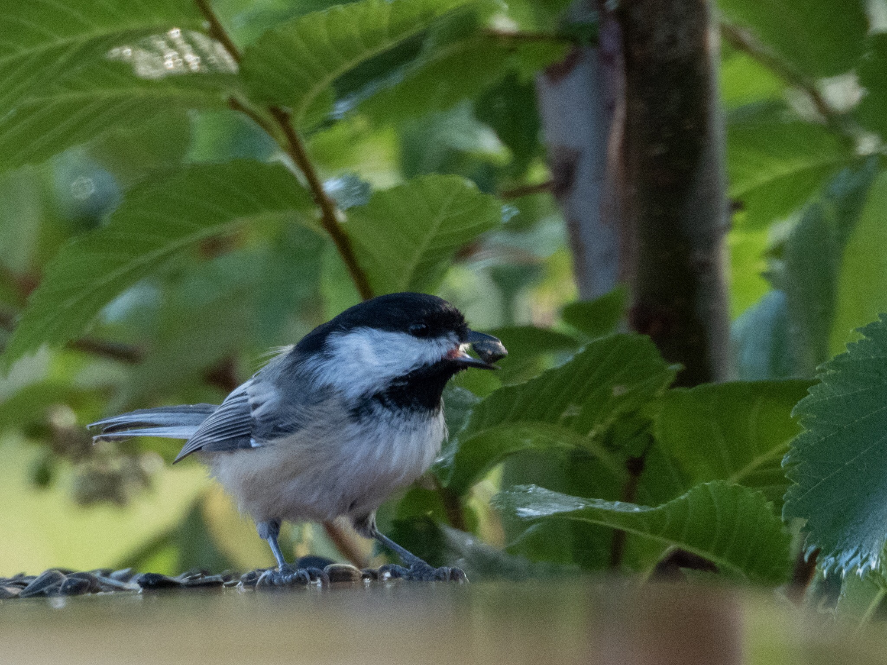

What is Project 366? Read more [here](https://thebirdsarecalling.com/2019/03/29/project-366/)!

Black-capped Chickadees may be one of our smallest birds but they are definitely one of the most resourceful and intelligent birds in these neck of the woods. There have learned to take full advantage of our weakness for cuteness and manipulated our feeble human minds to provide them with free snacks year round. Although I do not bring snacks, plenty of other people do. There are always piles of sun flower seed strewn about along the trail and on the bridge railings along Whitemud Creek. They swoop down, grab a sunflower seed and then fly off to a nearby shrub where they get to work on the seed. It's basically like a fly-through fast food joint. Chickadees are also known for hoarding food for leaner times. Although chickadees undeniably have small brains, they are no bird brains. They are very capable of remembering where they hide food stashes when they need to find them in the middle of the winter.

Black-capped Chickadee (_Parus atricapillus_) grabbing a quick snack at the Whitemud Creek. July 30, 2019. Nikon P1000, 1008mm @ 35mm, 1/320s, f/5.6, ISO 400

_May the curiosity be with you. This is from “The Birds are Calling” blog ([www.thebirdsarecalling.com](http://www.thebirdsarecalling.com)). Copyright Mario Pineda._
