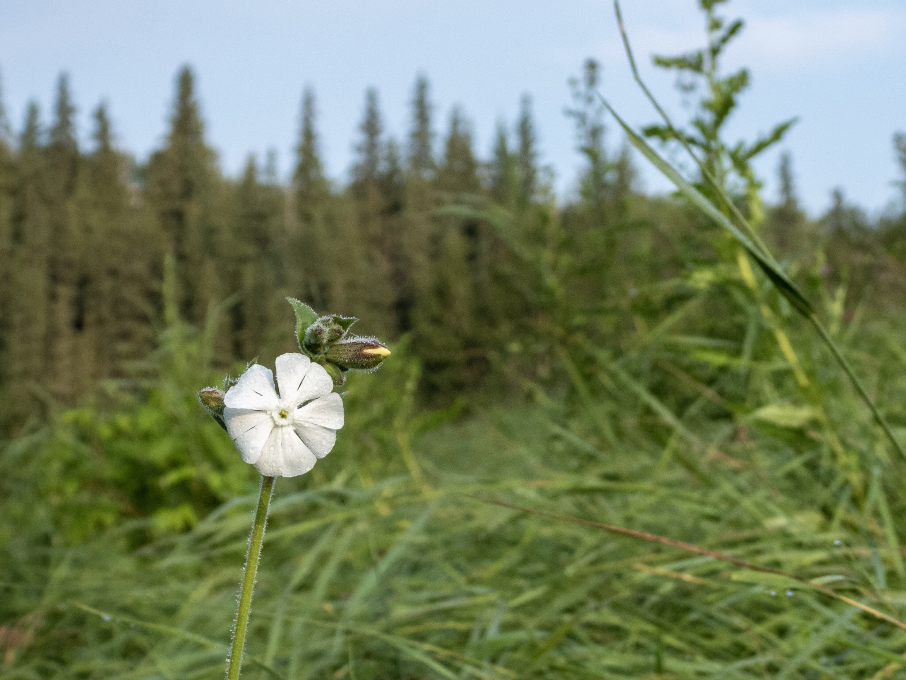

What is Project 366? Read more [here](https://thebirdsarecalling.com/2019/03/29/project-366/)!

Going birding mid-day is not ideal. Most birds are out of sight, but if you put your mind to it you might be able to hear them skulking in the shrubbery. For a birding noob like me the only thing more frustrating than no birds is hearing birds and being unable to see them and identify them. Plants have none of these problems. Be it dawn, mid-day or dusk - the plants are there. So on this late afternoon down by the Whitemud Creek I did not see much in terms of birds but I did encounter this patch of White Cockles. Like many of the pretty flowers I have encountered, this one is also an invasive species. White Cockles are commonly found in pastures, roadsides, waste areas, gardens and occasionally in cultivated fields. The White Cockle, also known as White Campion (_Lychnis alba syn. Silene alba S. latifolia_) was introduced from Eurasia and [rumor has it that it was introduced with ship ballast](https://www.nrcresearchpress.com/doi/pdf/10.4141/cjps77-164).

White Cockle (_Lychnis alba_) at the Whitemud Creek. July 31, 2019. Nikon P1000, 67mm @ 35mm, 1/800s, f/3.5, ISO 100

_May the curiosity be with you. This is from “The Birds are Calling” blog ([www.thebirdsarecalling.com](http://www.thebirdsarecalling.com)). Copyright Mario Pineda._
