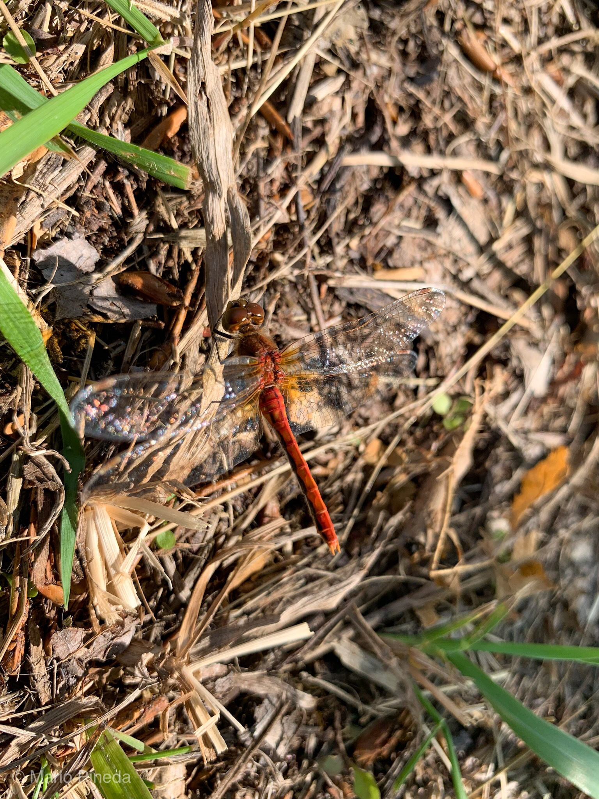

What is Project 366? Read more [here](https://thebirdsarecalling.com/2019/03/29/project-366/)!

Dragonflies are a bit of an oxymoron. While everyone is able to instantly recognize a dragonfly, very few people know the names of the various dragonfly species, never mind being able to tell them apart and identify them. I am no different. We had just finished a trail ride in Cooking Lake-Blackfoot Provincial Recreation Area and had taken a break for a snack at the Waskahegan Staging Area when a couple a dragonflies landed on a sunny patch on the ground right next to us. My camera was out of reach and I did not want to spook the dragonflies so I decided to try to use my phone to take some pictures. I took a few pictures from some distance away and then I slowly moved to phone closer and closer thinking that they will for sure take off. But they stayed. I managed to get about a foot away from this one dragonfly (the phone was not able to focus at a closer distance) and managed to take this close up. At the time I had no idea what it was, other than a dragonfly. After a bit of research it appears that it most likely is a species of Meadowhawk, specifically a Cherry-Faced Meadowhawk (_Sympetrum internum_), but there are a few other species of Meadowhawk that look very similar. The name “Meadowhawk” is quite telling of the ecology of this species. It is found near marshy ponds, lakes, slow streams and on meadows. Like all dragonflies, the Meadowhawk is a predator. I can just picture it patrolling the meadow like a hawk for any soft-bodies flying insects such as mosquitoes, flies, moths and mayflies.

Meadowhawk at Waskahegan Staging Area at Cooking Lake-Blackfoot Provincial Recreation Area . August 8, 2019.

_May the curiosity be with you. This is from “The Birds are Calling” blog ([www.thebirdsarecalling.com](http://www.thebirdsarecalling.com)). Copyright Mario Pineda._
