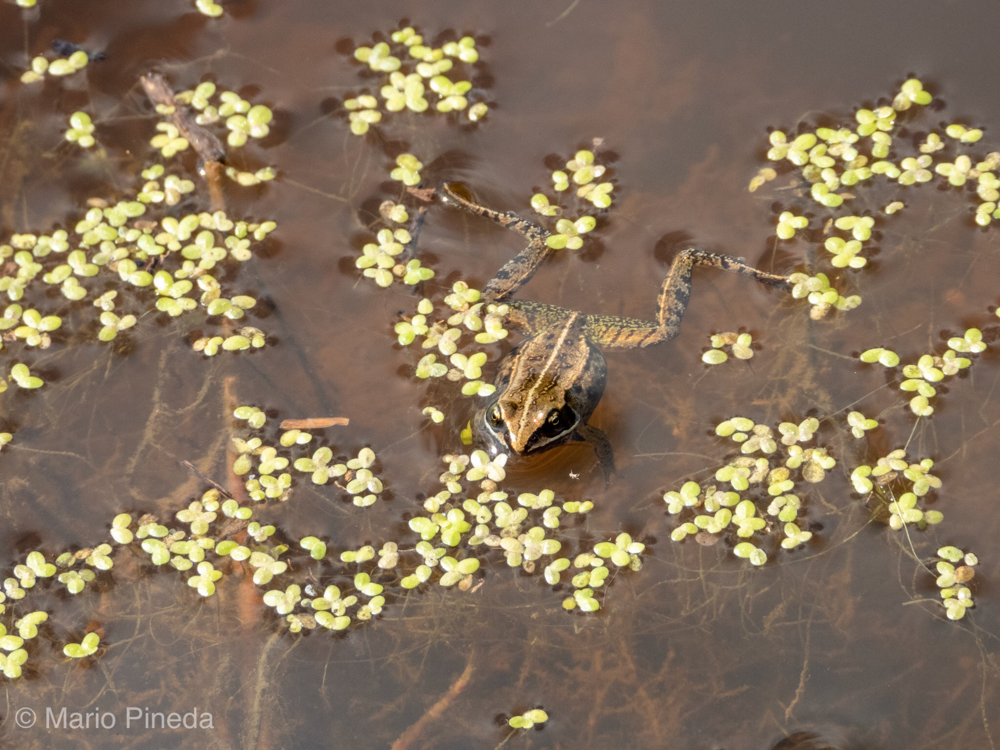

What is Project 366? Read more [here](https://thebirdsarecalling.com/2019/03/29/project-366/)!

This Wood Frog liked to live dangerously. It was basking at the surface of a shallow vernal pool of water in the middle of the trail as we came barraging along on our mountain bikes. The only reasons we managed to spot it was because we decided to get of our bikes and walk around the pool that nearly covered the entire width of the trail. Any other mountain biker would have seen this obstacle as a challenge one needs to tackle head on at full speed. The frog did not bat an eye as we spotted it and moved in closer to have a good look at it. Maybe it figured that if it just stays completely still we might not see it. Perhaps that is a viable strategy for the half a dozen garter snakes that we came across on the trail just a few hundered meters away, but it did not work with us..., then again, we were not considering it as our next meal.

Wood Frog (_Lithobates sylvaticus_) in vernal pool at the Cooking Lake-Blackfoot Provincial Recreation Area. August 8, 2019. Nikon P1000, 504mm @ 35mm, 1/320s, f/5, ISO 100

_May the curiosity be with you. This is from “The Birds are Calling” blog ([www.thebirdsarecalling.com](http://www.thebirdsarecalling.com)). Copyright Mario Pineda._
