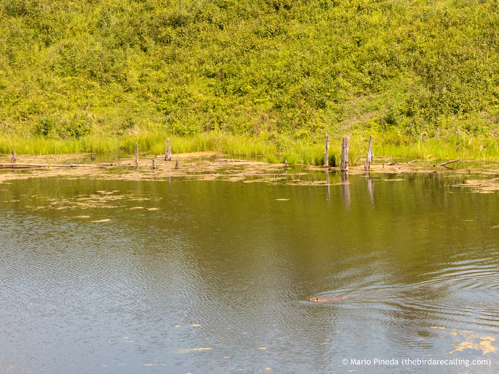

What is Project 366? Read more [here](https://thebirdsarecalling.com/2019/03/29/project-366/)!

The Cooking-Lake-Blackfoot Provincial Recreational Are is a large nature reserve east of Edmonton. This reserve is characterized by rolling hills and a “knob and kettle” terrain, containing glacial moraines and depressions filled with small lakes. In one of those kettle lakes we came across a solitary American Beaver doing laps back and forth across the lake. Was it doing it’s daily exercise regime, was it patrolling its territory or was it just generally restless? Who knows what goes through the head of a lonely beaver on a sunny summer day. The Cooking Lake-Blackfoot Provincial Recreational Area is part of a much larger 1600 square kilometre area known as Beaver Hills and was designated an [UNESCO Biosphere Reserve in 2016](http://www.unesco.org/new/en/natural-sciences/environment/ecological-sciences/biosphere-reserves/europe-north-america/canada/beaver-hills/).

Solitary American Beaver (_Castor canadensis_) in lake at the Cooking Lake-Blackfoot Provincial Recreation Area. August 8, 2019. Nikon P1000, 118mm @ 35mm, 1/800s, f/4, ISO 100

_May the curiosity be with you. This is from “The Birds are Calling” blog ([www.thebirdsarecalling.com](http://www.thebirdsarecalling.com)). Copyright Mario Pineda._
