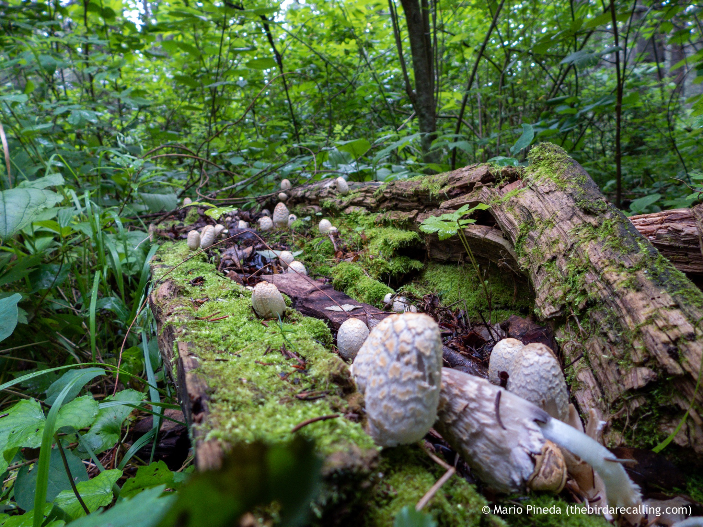

What is Project 366? Read more [here](https://thebirdsarecalling.com/2019/03/29/project-366/)!

Most mushrooms I have encountered are difficult to identify to say the least. When I came across this fungi growing out of a rotting log on the moist forest floor I figure that something this distinct looking should be easier to identify. I did nevertheless take me quite some time to identify it, mainly because it took me a while to find an appropriate online reference for Alberta fungi. My best educated guess is that it is a Shaggy Mane, also known as Shaggy Ink Cap or Lawyer’s Wig (_Coprinus comatus_). In this fungi the young fruit bodies first appear as white cylinders emerging from the ground, reminiscent of [The Gherkin](https://en.m.wikipedia.org/wiki/30_St_Mary_Axe). As the fruit bodies mature a bell-shaped cap opens out (you can see one in the far right foreground in the picture). It is edible, but I am not about to take any chances just in case I got the identification wrong. The species is carnivorous specializing in trapping, killing and digesting underground nematodes (microscopic underground roundworms) to obtain nutrients (so called nematophagy).

_Shaggy Mane (Coprinus comatus) at Whitemud Ravine.July 31, 2019. Nikon P1000,_ 24_mm @ 35mm, 1/30s, f/2.8, ISO 100_

_May the curiosity be with you. This is from “The Birds are Calling” blog ([www.thebirdsarecalling.com](http://www.thebirdsarecalling.com)). Copyright Mario Pineda._
