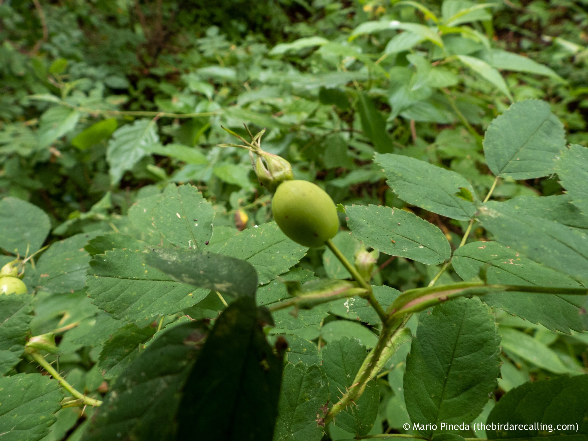

What is Project 366? Read more [here](https://thebirdsarecalling.com/2019/03/29/project-366/)!

The flowers of the Prickly Wilde Roses are long gone and have been replaced by green hips. As they ripen they will turn orange and then red. The hips are edible, something the First Nations and Swedes have known since the dawn of time. I’ll be keeping my eyes on the rose hips to harvest some when they become ripe. Making rose hip tea might be the easiest way of reaping some of the health benefits of these fruits or, if I feel adventurous, I might just make a batch of [rose hip soup](https://en.m.wikipedia.org/wiki/Rose_hip_soup). The wilting of the flowers and the ripening of fruits signals the impeding end of the summer. Technically September 23 is the last day of summer but typically things turn fall’ish much earlier in these neck of the woods.

_Prickly Wild Rose hip at Whitemud Ravine. July 31, 2019. Nikon P1000,_ 24_mm @ 35mm, 1/30s, f/2.8, ISO 100_

_May the curiosity be with you. This is from “The Birds are Calling” blog ([www.thebirdsarecalling.com](http://www.thebirdsarecalling.com)). Copyright Mario Pineda._
