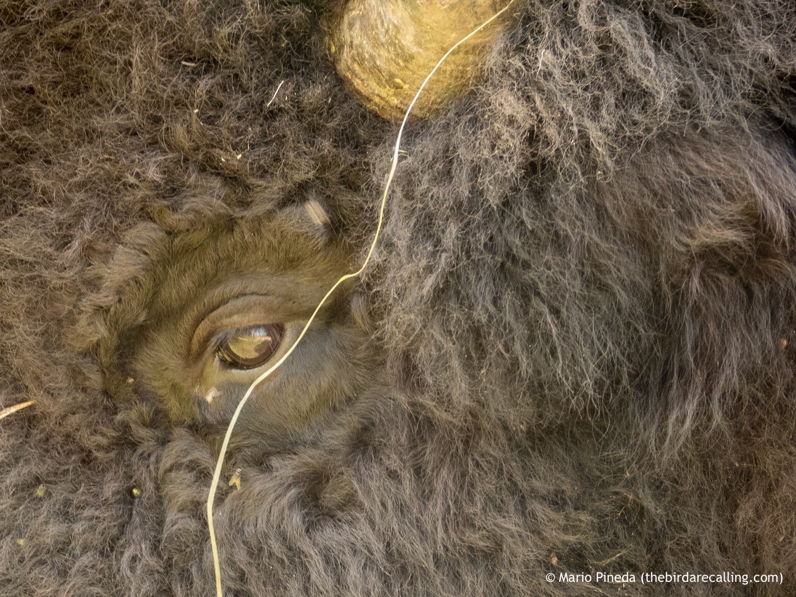

What is Project 366? Read more [here](https://thebirdsarecalling.com/2019/03/29/project-366/)!

After seeing plenty of Wood Bison at a distance dotting pastures, fields and forest edges I imagined that the day I would get close and personal with the largest terrestrial animal in the americas would be along a remote trail far away from human civilization. Well I could not me more mistaken. I came across this gigantic male Wood Bison right by the fence along Highway 16. I had stopped on a gravel road turn-out along the highway and there he was, a solitary male Wood Bison, right on the other side of the fence. I could have reached out and touched him if I wanted to. I decided not to give him any reason to tear down the fence and go after me. He was certainly curious though. As I approached the fence he came right up to meet me, not the least shy. Although the wire fence looked solid and was at least 6 feet tall it would not stand a chance against an adult Wood Bison hellbent on getting through. I did manage to get some nice closed up pictures of him, including this one where he is staring me down probably wondering what my intentions were.

The eye of the Wood Bison at Elk Island National Park. August 8, 2019. Nikon P1000, 325mm @ 35mm, 1/60s, f/4.5, ISO 400

_May the curiosity be with you. This is from “The Birds are Calling” blog ([www.thebirdsarecalling.com](http://www.thebirdsarecalling.com)). Copyright Mario Pineda._
