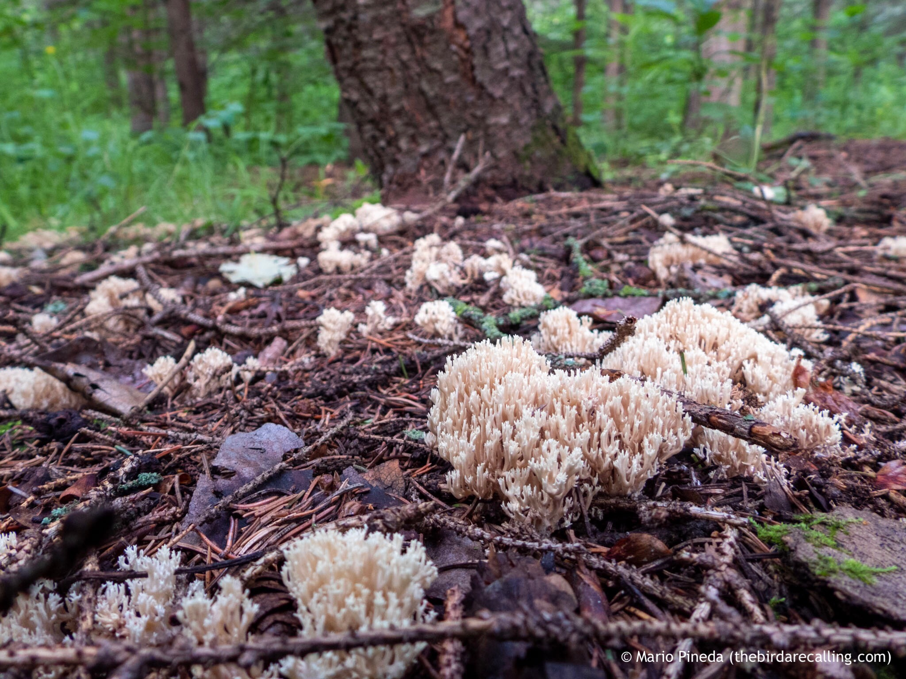

What is Project 366? Read more [here](https://thebirdsarecalling.com/2019/03/29/project-366/)!

So a mushroom walks into a party and the bouncer says, “Sorry we are full”. The mushroom replies: “But I don't take up mushroom”.

Now that we have that out of the way,... this is without question the funkiest looking fungus I have come across so far. Initially I was even questioning if it was a fungus or something else altogether. But it turns out it is a fungus, a fungus that looks like no other fungus. The fruiting body seems to defy every notion of how a fungus should look. Where is the cap and the stalk? It turns out this one belongs to the clavarioid fungi group (after the genus Clavaria). These fungi are more commonly referred to as coral fungi. Despite the absence of the classical fairytale “mushroom look” it turns out that coral fungi do not only have a worldwide distribution but are one of the most common groups of fungi. With over 1200 species of coral fungi identifying the exact species is well beyond my ability, but apparently these fellas are edible.

Coral Fungus at Whitemud Creek. August 2, 2019. Nikon P1000, 24mm @ 35mm, 1/30s, f/2.8, ISO 140

_May the curiosity be with you. This is from “The Birds are Calling” blog ([www.thebirdsarecalling.com](http://www.thebirdsarecalling.com)). Copyright Mario Pineda._
