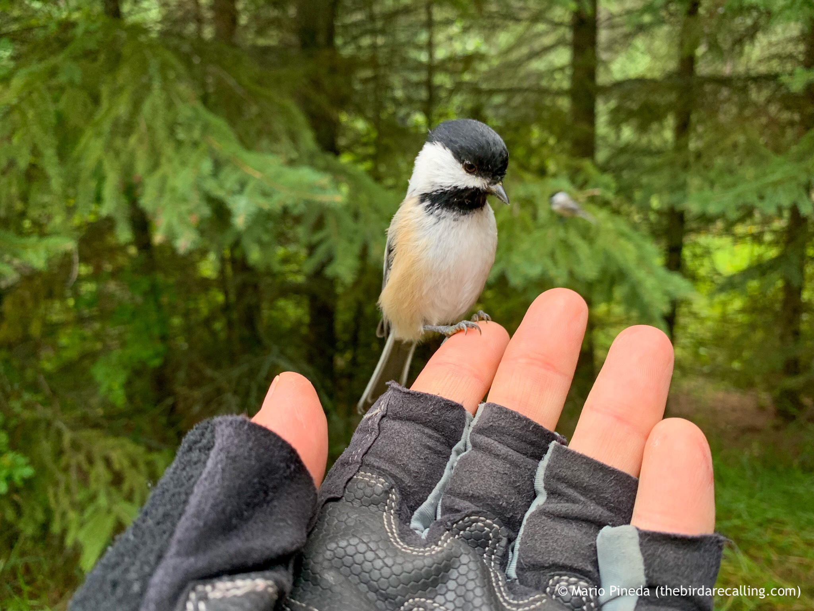

What is Project 366? Read more [here](https://thebirdsarecalling.com/2019/03/29/project-366/)!

\[Walking softly through the forest\]
BIRD: Fee-bee! Fee-bee! Fee-bee! Fee-bee!
HUMAN: Who are you?
BIRD: We are the Chickadees that say... Fee-bee!
HUMAN: No! Not the Chickadees that say Fee-bee!
BIRD: The same!
HUMAN: Those who hear them seldom live to tell the tale!
BIRD: The Chickadees Who Say Fee-bee demand a sacrifice!
HUMAN: Chickadees of Fee-bee, I am but a simple birder who seek the enchanter who lives beyond these woods.
BIRD: Fee-bee! Fee-bee! Fee-bee! Fee-bee!
HUMAN: Oh, ow!
BIRD: We shall say 'Fee-bee' again to you if you do not appease us.
HUMAN: Well, what is it you want?
BIRD: We want... sunflower seeds!

Black-capped Chickadees have a remarkably complex and varied repertoire of vocalizations, but perhaps the most common song carrying through the forest is their characteristic fee-bee (aka as ‘Hey, sweetie’). You can listen to recordings of their vocalizations [here](https://www.allaboutbirds.org/guide/Black-capped_Chickadee/sounds). As I was making my way along the Whitemud Ravine trail the Black-capped Chickadees came out in full force confronting me. The exchange that followed was remarkably reminiscent of the exchange King Arthur has with the Nights of Ni in Monty Python and The Holy Grail. In case you are not familiar with this scene you can enjoy it in all its glory right [here](https://youtu.be/zIV4poUZAQo). This band of Chickadees meant business. A dozen chickadees quickly surrounded me, perching in the shrubbery and on the ground around my feet and said ‘fee-bee, fee-bee, fee-bee’. One of them landed on my leg. Another one went straight for my outstretched hand. When it realized that I had not brought an offering I received a condescending look of disbelieve and indignation. I had no other choice than continue walking with a dozen chickadees tagging along fee-bee’ing me incessantly.

The Black-capped Chickadees of Fee-bee demanding an offering at Whitemud Creek. August 18, 2019. Photo using iPhone.

_May the curiosity be with you. This is from “The Birds are Calling” blog ([www.thebirdsarecalling.com](http://www.thebirdsarecalling.com)). Copyright Mario Pineda._
