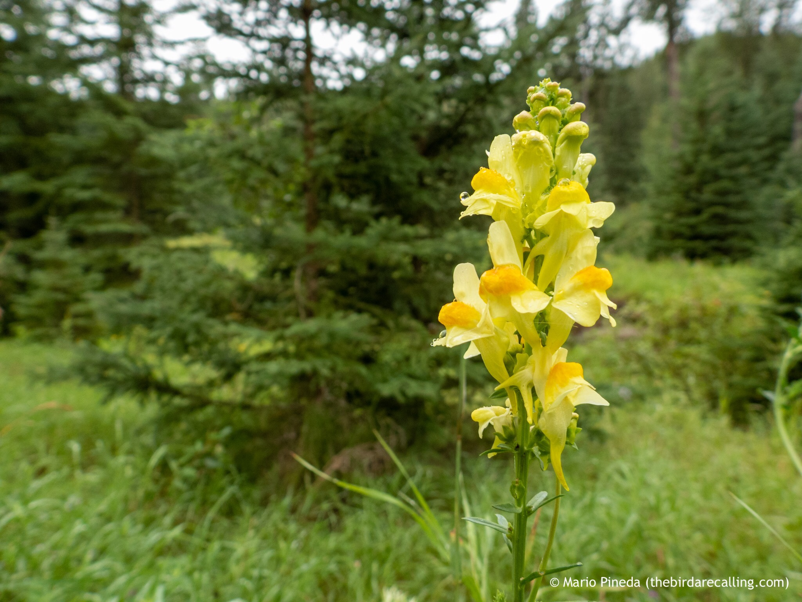

What is Project 366? Read more [here](https://thebirdsarecalling.com/2019/03/29/project-366/)!

Another pretty face and another invasive species. The striking Butter-and-egg plant _(Linaria vulgaris)_ is native to Europe and Asia. It was introduced in North America as a decorative garden plant. It did not take long for it to escape and the rest is history. These days it is common throughout North America, from Canada in the north to Mexico in the south. While this plant is also know as Common Toadflax and Yellow Toadflax the Butter-and-eggs name seems most imaginative. Where does it get such an odd name from? I am not sure, but perhaps it has to do with the color of the snap-dragon shaped flower with the darker yellow/orange being the yolk and the lighter yellow being the butter. It turns out that orange center part is known as a “honey guide” guiding pollinators along the long spur of the flower. My teenager disagrees with this interpretation and has concluded that the name does as much sense as calling it “Yellow-and-green”. “I went for a walk and saw some Yellow-and-green and some Purple-and-green”. Perhaps he is right, the name seems quite silly, so I guess it is a silly and pretty invader.

Butter-and-egg (Linaria vulgaris) at the Whitemud Creek. August 18, 2019. Nikon P1000, 24mm @ 35mm, 1/100s, f/2.8, ISO 100

_May the curiosity be with you. This is from “The Birds are Calling” blog ([www.thebirdsarecalling.com](http://www.thebirdsarecalling.com)). Copyright Mario Pineda._
