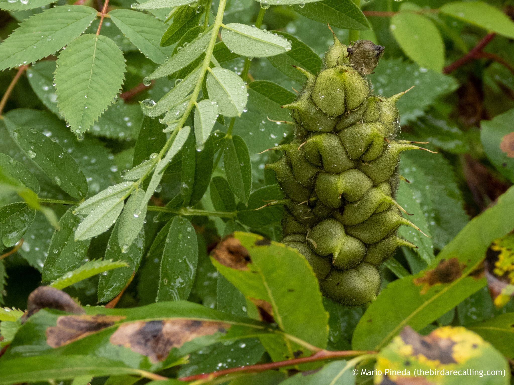

What is Project 366? Read more [here](https://thebirdsarecalling.com/2019/03/29/project-366/)!

I came across these unique looking seed pods along the Whitemud Creek the other day. I have never seen anything like it so I was quite intrigued. The actual seeds were riddling around inside the sed pod so it was almost like a gigantic rattlesnake rattle. It turns out that the rattle belongs to Cicer milkvetch (_Astragalus cicer_) a perennial legume introduced from Europe for pasture and forage for cattle. The seeds go unharmed throughly the digestive system of cattle and farmers are taking advantage of this manure/seeding technique to help the Cicer Milkvetch spread to new pastures. They let their cows graze on a pasture where Cicer Milkvetch is present and then they move the cows to another pasture that does not have this plant. As the cow deposit their manure on the new field they introduce the Cicer Milkvetch seeds and the plant gets a foothold.

Cicer milkvetch (_Astragalus cicer_) at Whitemud Creek. August 18, 2019. Nikon P1000, 140mm @ 35mm, 1/60s, f/4, ISO 250

_May the curiosity be with you. This is from “The Birds are Calling” blog ([www.thebirdsarecalling.com](http://www.thebirdsarecalling.com)). Copyright Mario Pineda._
