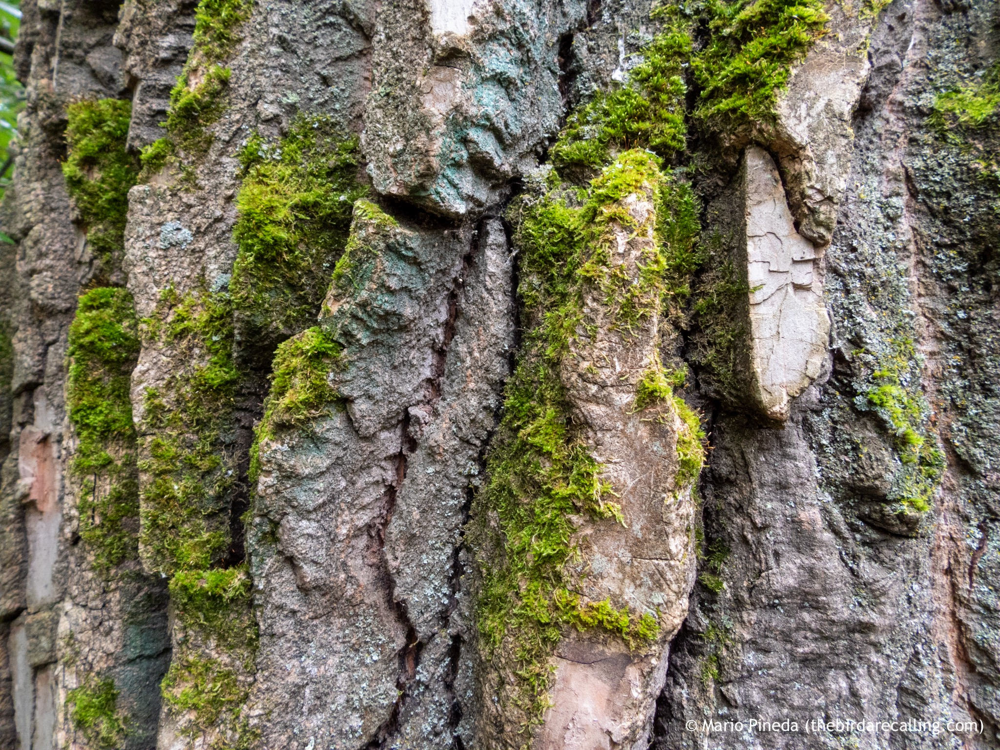

What is Project 366? Read more [here](https://thebirdsarecalling.com/2019/03/29/project-366/)!

The age old idea that moss grows on the north side of trees seems to be true, at least on the older larger trees down at the Whitemud Ravine. The picture below shows the north side of an old growth deciduous tree, the south side of the trunk was completely free from moss growing on it. Moss growing one the north side of the trunks makes sense as the north side of a tree generally get les sun light, is cooler, more damp and more shaded. All of these are perfect conditions for mosses too become established. Apparently in the Southern Hemisphere it is the opposite situation, moss tends to growth on the south side of three trunks. Mental note to self: Check tree trunks when visiting South America next time..., and the direction the toilet flushes.

_Moss covered tree trunk at Whitemud Creek. August 18, 2019. Nikon P1000, 26mm @ 35mm, 1/_25_s, f/2.8, ISO 400_

_May the curiosity be with you. This is from “The Birds are Calling” blog ([www.thebirdsarecalling.com](http://www.thebirdsarecalling.com)). Copyright Mario Pineda._
