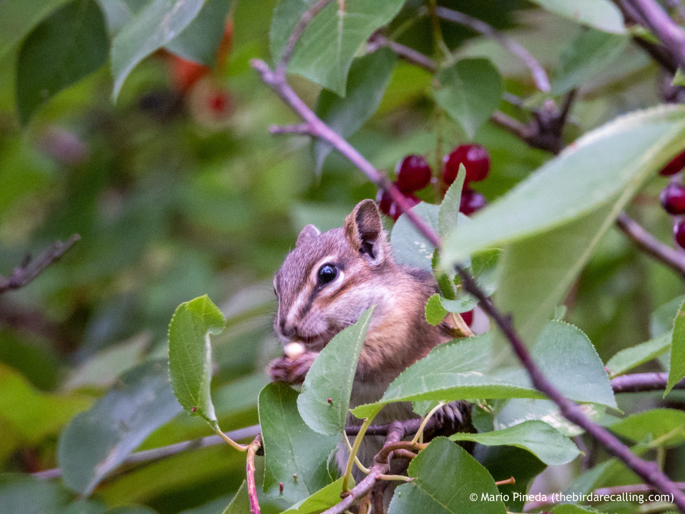

What is Project 366? Read more [here](https://thebirdsarecalling.com/2019/03/29/project-366/)!

As I was walking along the trail down at Whitemud Ravine a subtle rustle of leaves from a grove of High-bush Cranberries caught my attention. The bushes were laden with ripe berries and I assumed that the noise came from birds enjoying a snack. I tried to coax my eyes into focusing in on the source of the rustle. It took a while, but then I saw a quick flash of a diminutive bushy tail. That was sufficient evidence to identify the culprit. A Least Chipmunk was balancing on the thin branches of one of the bushes and gorging itself with ripe berries. Summer is coming to an end and the forest is full of ripe berries, fruits, nuts and mushrooms. The squirrels, chipmunks and birds are bushy feasting on the bounty and hoarding supplies for the long winter. Further down the trail I came across a Red Squirrel enjoying a nut from a Beaked Hazelnut bush and another one carrying an entire apple (it was a small apple).

_Least Chipmunk having a snack in a High-bush Cranberry at Whitemud Creek. August 22, 2019. Nikon P1000,_ 806_mm @ 35mm, 1/30s, f/5.6, ISO 1100_

_May the curiosity be with you. This is from “The Birds are Calling” blog ([www.thebirdsarecalling.com](http://www.thebirdsarecalling.com)). Copyright Mario Pineda._
