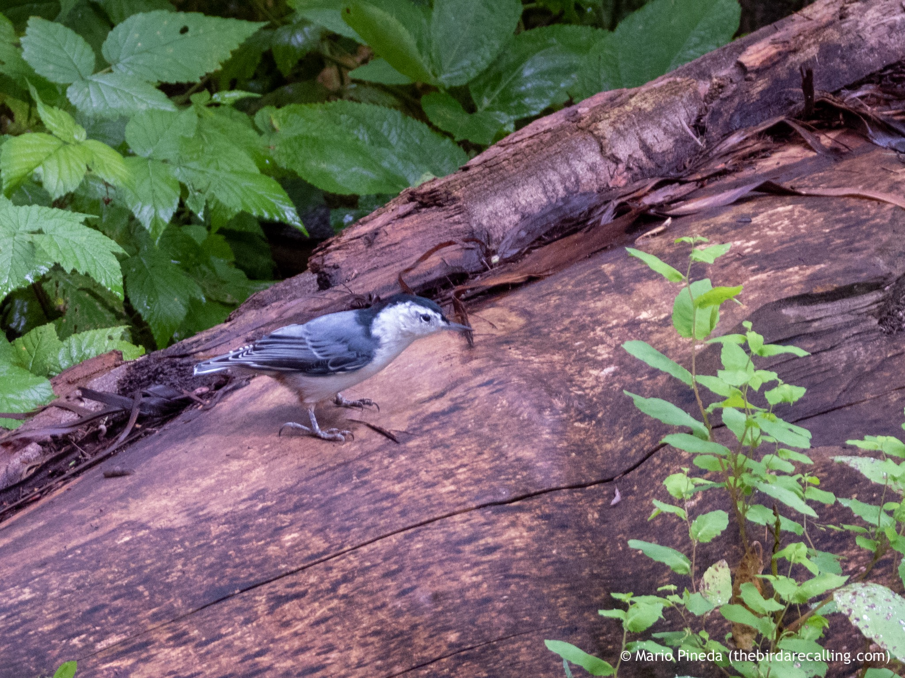

What is Project 366? Read more [here](https://thebirdsarecalling.com/2019/03/29/project-366/)!

Nuthatches are common at the Whitemud Ravine but tricky to take pictures of as they never seem to sit still. I managed to snap this on single picture of a White-breasted Nuthatch sitting on a log for a second before it quickly moved on. Nuthatches forage on insects climbing around on trunks and branches and are unique as they often move head-first down trees and can even hang upside-down beneath twigs and branches. They have a quite distinctive call so it is easy to pick them out in the forest, it's another thing to actually spot them though. The White-breasted Nuthatch is the larger of the two nuthatches we have in Alberta, the other one being the Red-breasted Nuthatch.

_Least Chipmunk having a snack in a High-bush Cranberry at Whitemud Creek. August 22, 2019. Nikon P1000, 806mm @ 35mm, 1/30s, f/5.6, ISO 1100_

_May the curiosity be with you. This is from “The Birds are Calling” blog ([www.thebirdsarecalling.com](http://www.thebirdsarecalling.com)). Copyright Mario Pineda._
