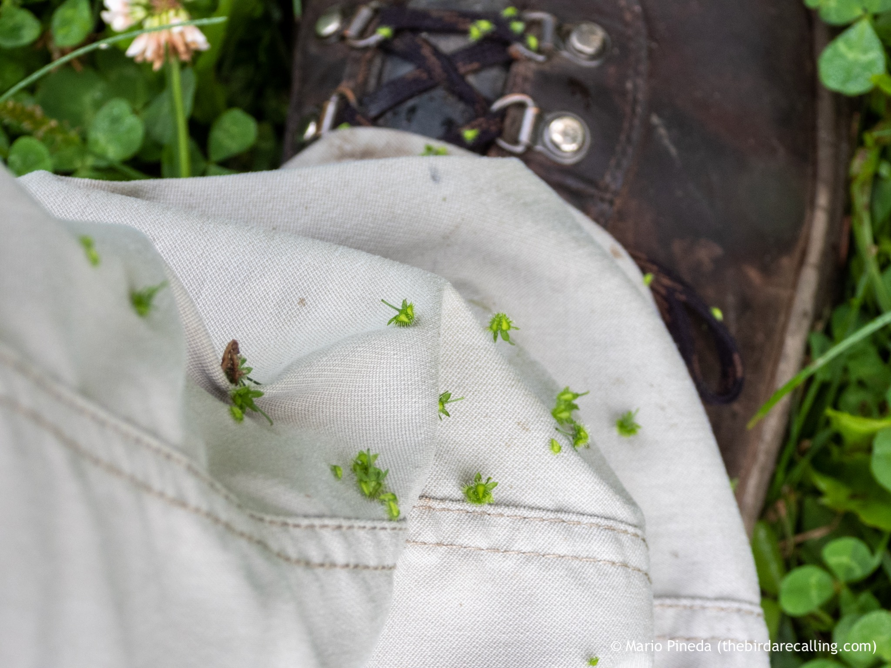

What is Project 366? Read more [here](https://thebirdsarecalling.com/2019/03/29/project-366/)!

Sometimes it is fun to take the less travelled patch and go off roading during a nature walk. You never know what you will come across when you get away from the main trail and go for a bit of bush whacking. This time, however, I did not realize what I had ran into until after the fact. As I was on my way home I realize my pant legs were covered in burs. I was essentially being used as a vehicle for dispersal and reproduction by a plant. A but is a seed or dry fruit that has hooks or teeth that catch on the fur of passing animals or on the clothing of people. The technical term for this type of dispersal is epizoochory, aka dispersal by attaching to the outside of animals. After I came home I spends some time picking the burs of the pants, but gave up after a while. They were pretty well attached and there were so many that I would be at it the rest of the day if I continued removing them one by one. So I went ahead and washed the pants in the laundry machine. Guess what, they remain attached to the pants. At this point I am thinking of leaving them attached to see if they eventually fall off. After all, this would not be a very successful dispersal strategy if the burs never came off on their own. Apparently burs were the inspiration for Velcro fasteners.

Bird stuck to pant legs after a hike off the beaten track _at Whitemud Creek. August 2, 2019. Nikon P1000, 134mm @ 35mm, 1/_125_s, f/4, ISO 100_

_May the curiosity be with you. This is from “The Birds are Calling” blog ([www.thebirdsarecalling.com](http://www.thebirdsarecalling.com)). Copyright Mario Pineda._
