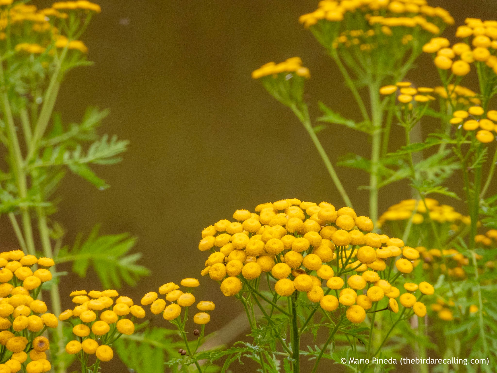

What is Project 366? Read more [here](https://thebirdsarecalling.com/2019/03/29/project-366/)!

Lately I have come across dense stands of Common Tansy (_Tanacetum vulgare_) along the banks of the Whitemud Creek. I have probably unconsciously seen it all through summer but it is not until now, with its unique yellow button-like flowers arranged in dense, flat-topped clusters that I have noticed it and been able to identify it. Like many of the wildflowers I have come across over the summer the Tansy has also been introduced to North america from its native Europe and Asia. Tansy contains alkaloids that are toxic to both humans and livestock, but despite this it has a long history of medicinal uses. Because of its medicinal uses one can still find this plant in nurseries to be used in gardens. The Alberta Invasive Species Council classifies this plant as noxious and discourages gardeners from purchasing and growing the Common Tansy.

_Tansy (Tanacetum vulgare) at Whitemud Creek. August 18, 2019. Nikon P1000, 655mm @ 35mm, 1/200s, f/5, ISO 400_

_May the curiosity be with you. This is from “The Birds are Calling” blog ([www.thebirdsarecalling.com](http://www.thebirdsarecalling.com)). Copyright Mario Pineda._
