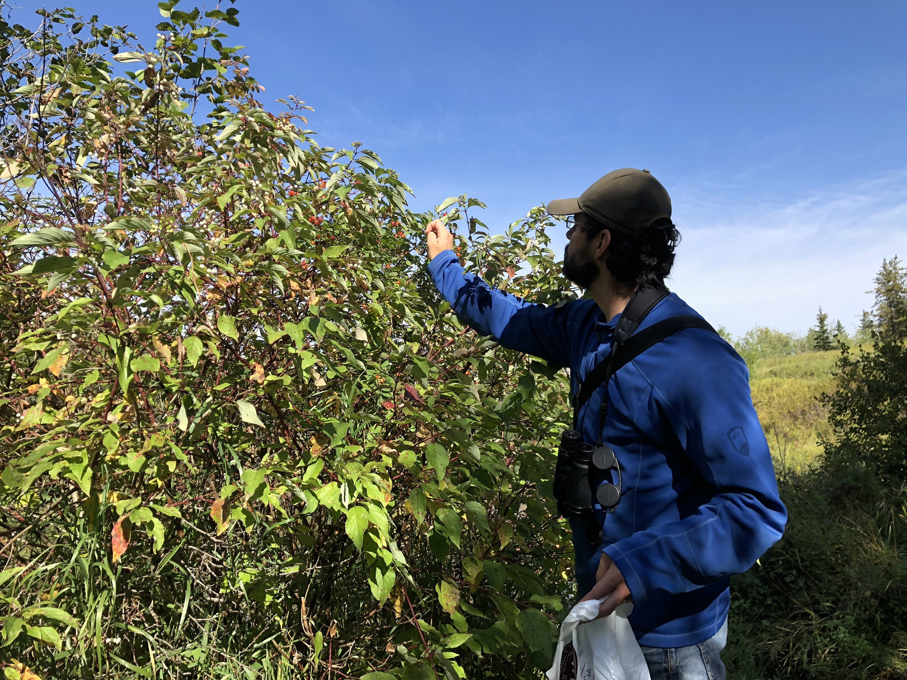

What is Project 366? Read more [here](https://thebirdsarecalling.com/2019/03/29/project-366/)!

Lots of people harvest what nature has to offer, most often in the form of hunting or fishing. I have, however, not encountered many people that harvest wild plants or parts of wild plants. Recently we met a gentleman down by the creek that was harvesting Chokeberry for himself and his family. He told us that people these days, specially in the cities, do not harvest wild plants, berries, fruit or mushrooms. So we thought, let’s try something new and the other day we went out down to the creek to harvest some rose hips. I am well-familiar with rose hips as it is commonly consumed in Europe, where I grew up. I have never, however, harvested my own rose hips so this was a new experience for me. Rose hips felt like a safe choice as there is nothing else around that could me mistaken for rose hips. Berries can be trickier and mushrooms are definitely beyond my comfort zone at this point.

_May the curiosity be with you. This is from “The Birds are Calling” blog ([www.thebirdsarecalling.com](http://www.thebirdsarecalling.com)). Copyright Mario Pineda._
