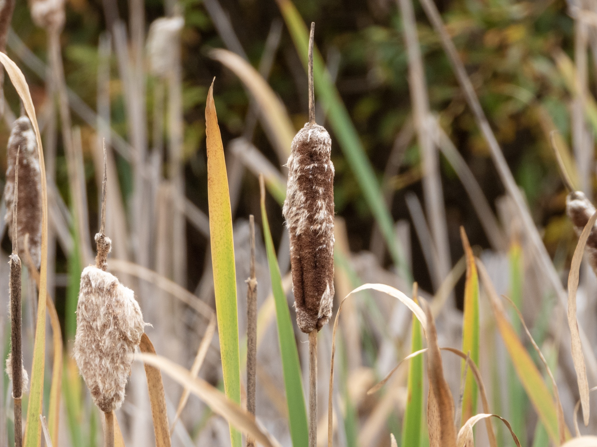

What is Project 366? Read more [here](https://thebirdsarecalling.com/2019/03/29/project-366/)!

I like the word "mangy". The sound of the word aptly conveys its meaning (something that is in poor condition or shabby) and finally (after 188) posts I have reasons to use the word in a post. The cattails along the shores of the Heritage Wetlands are mangy these days as they are wilting, disintegrating and falling apart. Clearly they have reached the end of their life. Technically speaking the term cattail refers to the plant itself and not just the characteristic brown furry fruiting spikes. When mature, which would be about now I presume, the spike disintegrates to release cottony masses of minute wind-dispersed seeds.  

_May the curiosity be with you. This is from “The Birds are Calling” blog ([www.thebirdsarecalling.com](http://www.thebirdsarecalling.com)). Copyright Mario Pineda._
