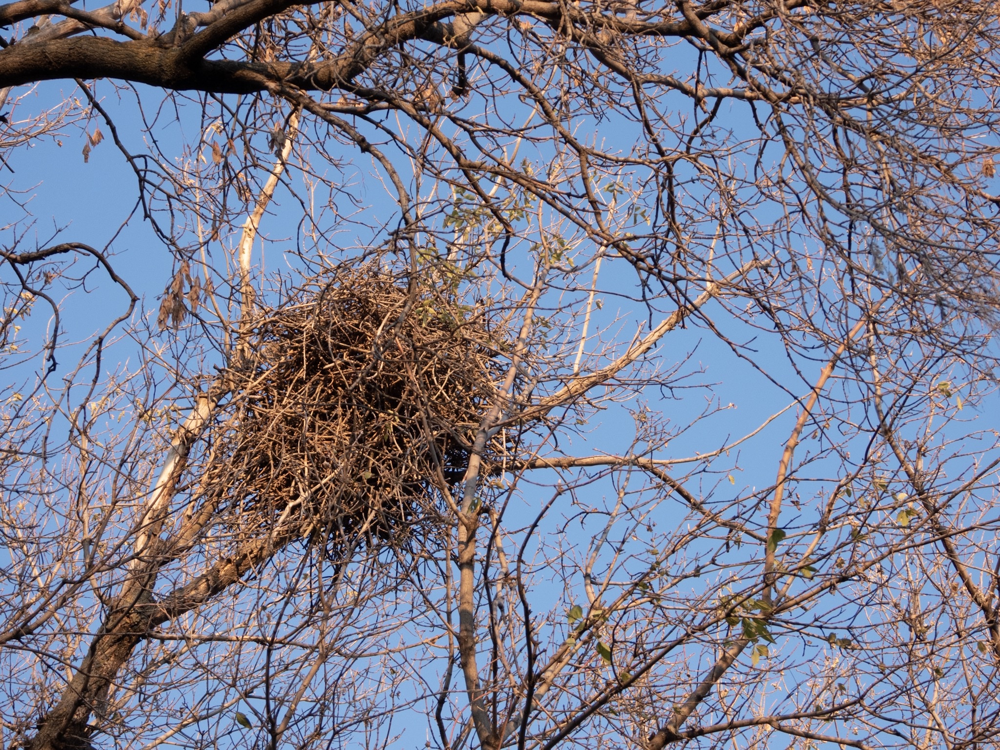

What is Project 366? Read more [here](https://thebirdsarecalling.com/2019/03/29/project-366/)!

Now that the leaves are gone one can see them. Large conspicuous stick nests high up in the tree crowns all along the trails down by the North Saskatchewan river. When the trees had leaves the nests were, despite their size, almost impossible to spot. Now, with the leaves gone, one would be hard pressed to miss the nests. The nests are empty as their tenants have moved on on their southward migrations. Who build and occupied these nests? Judging from the size it was likely a larger species, perhaps a corvid such as crows, ravens or jays. Now that I know where the nests are located, I can keep an eye on them next spring to see who moves in (which does not necessarily have to be the same inhabitants as this year).

_May the curiosity be with you. This is from “The Birds are Calling” blog ([www.thebirdsarecalling.com](http://www.thebirdsarecalling.com)). Copyright Mario Pineda._
