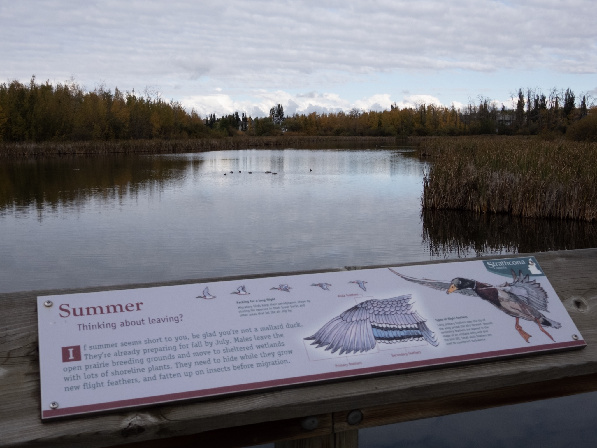

What is Project 366? Read more [here](https://thebirdsarecalling.com/2019/03/29/project-366/)!

Today’s post is brought to you from Heritage Wetland park. Along the boardwalk going around the ponds there are informational displays for visitors. One of these displays is about the flight feathers of mallards. So I will let the anonymous writer of this display to do the talking today.

> If summer seems short to you, be glad you’re not a mallard duck. They’re already preparing for fall by July. Males leave the open prairie breeding grounds and move to sheltered wetlands with lots of shoreline plants. They need to hide while they grow new flight feathers, and fatten up on insects before migration.

_May the curiosity be with you. This is from “The Birds are Calling” blog ([www.thebirdsarecalling.com](http://www.thebirdsarecalling.com)). Copyright Mario Pineda._
