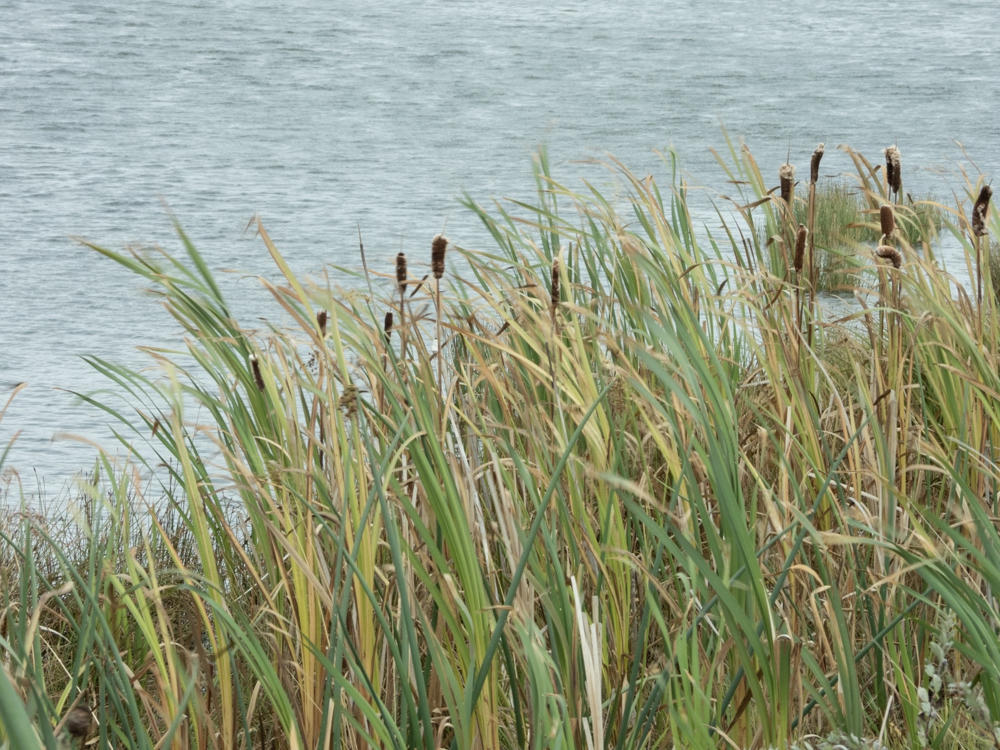

What is Project 366? Read more [here](https://thebirdsarecalling.com/2019/03/29/project-366/)!

According to the Beaufort Scale for measuring the strength of wind the wind gusts on this day were at around Beaufort number 6, which is defined as a strong breeze with large branches in motion and umbrellas used with difficulty. I did not have an umbrella to check if it would be possible to use it, but there was plenty of reed that was being whipped back and forth by the gusts. Talking about “large numbers”, this is post number 200. 166 left to go. I thought this would be a marathon, but I was mistaken. I passed the “marathon threshold” a long time ago. This is more like a Forest Gump-style ultra marathon.

_May the curiosity be with you. This is from “The Birds are Calling” blog ([www.thebirdsarecalling.com](http://www.thebirdsarecalling.com)). Copyright Mario Pineda._
